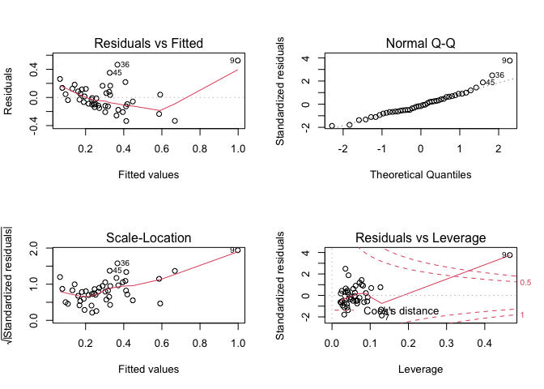
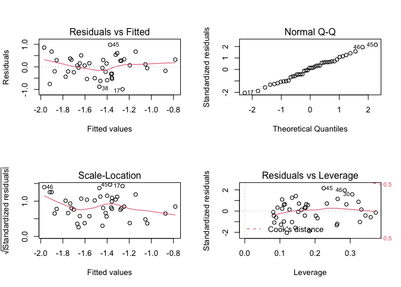

BM1 final project
================

    ## 'data.frame':    48 obs. of  9 variables:
    ##  $ state                                  : chr  "Alabama" "Alaska" "Arizona" "Arkansas" ...
    ##  $ unemployment                           : Factor w/ 2 levels "low","high": 2 2 2 2 2 1 2 1 2 2 ...
    ##  $ urbanization                           : Factor w/ 2 levels "low","high": 1 1 2 1 2 2 2 2 2 2 ...
    ##  $ median_household_income                : int  42278 67629 49254 44922 60487 60940 70161 57522 68277 46140 ...
    ##  $ perc_population_with_high_school_degree: num  0.821 0.914 0.842 0.824 0.806 0.893 0.886 0.874 0.871 0.853 ...
    ##  $ perc_non_citizen                       : num  0.02 0.04 0.1 0.04 0.13 0.06 0.06 0.05 0.11 0.09 ...
    ##  $ gini_index                             : num  0.472 0.422 0.455 0.458 0.471 0.457 0.486 0.44 0.532 0.474 ...
    ##  $ perc_non_white                         : num  0.35 0.42 0.49 0.26 0.61 0.31 0.3 0.37 0.63 0.46 ...
    ##  $ hate_crimes_per_100k_splc              : num  0.1258 0.1437 0.2253 0.0691 0.2558 ...

## Descriptive statistics+Graphs

    ## 
    ## Table: Descriptive Characteristics of Study Sample, Hate Crimes Occurring in the United States (By State)
    ## 
    ## |                                                         |   Overall (N=48)    |
    ## |:--------------------------------------------------------|:-------------------:|
    ## |Hate crime rate per 100k population                      |                     |
    ## |-  Mean/SD                                               |     0.30 (0.25)     |
    ## |-  Median                                                |        0.23         |
    ## |-  IQR                                                   |        0.21         |
    ## |-  Min - Max                                             |     0.07 - 1.52     |
    ## |-  Missing                                               |          3          |
    ## |Level of state unemployment                              |                     |
    ## |-  low                                                   |     25 (52.1%)      |
    ## |-  high                                                  |     23 (47.9%)      |
    ## |-  Missing                                               |          0          |
    ## |Level of state urbanization                              |                     |
    ## |-  low                                                   |     24 (50.0%)      |
    ## |-  high                                                  |     24 (50.0%)      |
    ## |-  Missing                                               |          0          |
    ## |Median household income per state                        |                     |
    ## |-  Mean/SD                                               | 55752.50 (9016.68)  |
    ## |-  Median                                                |      55431.50       |
    ## |-  IQR                                                   |      11827.00       |
    ## |-  Min - Max                                             | 39552.00 - 76165.00 |
    ## |-  Missing                                               |          0          |
    ## |Percentage of adults (>25 yrs) with a high school degree |                     |
    ## |-  Mean/SD                                               |     0.87 (0.03)     |
    ## |-  Median                                                |        0.87         |
    ## |-  IQR                                                   |        0.06         |
    ## |-  Min - Max                                             |     0.80 - 0.92     |
    ## |-  Missing                                               |          0          |
    ## |Percentage of population that are not US citizens        |                     |
    ## |-  Mean/SD                                               |     0.05 (0.03)     |
    ## |-  Median                                                |        0.04         |
    ## |-  IQR                                                   |        0.05         |
    ## |-  Min - Max                                             |     0.01 - 0.13     |
    ## |-  Missing                                               |          0          |
    ## |Gini index                                               |                     |
    ## |-  Mean/SD                                               |     0.45 (0.02)     |
    ## |-  Median                                                |        0.45         |
    ## |-  IQR                                                   |        0.03         |
    ## |-  Min - Max                                             |     0.42 - 0.53     |
    ## |-  Missing                                               |          0          |
    ## |Percentage of population that are non-white              |                     |
    ## |-  Mean/SD                                               |     0.32 (0.16)     |
    ## |-  Median                                                |        0.29         |
    ## |-  IQR                                                   |        0.22         |
    ## |-  Min - Max                                             |     0.06 - 0.81     |
    ## |-  Missing                                               |          0          |

<!-- -->

## Varible Selection

<!-- -->

    ##                                         median_household_income
    ## median_household_income                                    1.00
    ## perc_population_with_high_school_degree                    0.65
    ## perc_non_citizen                                           0.30
    ## gini_index                                                -0.13
    ## perc_non_white                                             0.04
    ## hate_crimes_per_100k_splc                                  0.34
    ##                                         perc_population_with_high_school_degree
    ## median_household_income                                                    0.65
    ## perc_population_with_high_school_degree                                    1.00
    ## perc_non_citizen                                                          -0.26
    ## gini_index                                                                -0.54
    ## perc_non_white                                                            -0.50
    ## hate_crimes_per_100k_splc                                                  0.26
    ##                                         perc_non_citizen gini_index
    ## median_household_income                             0.30      -0.13
    ## perc_population_with_high_school_degree            -0.26      -0.54
    ## perc_non_citizen                                    1.00       0.48
    ## gini_index                                          0.48       1.00
    ## perc_non_white                                      0.75       0.55
    ## hate_crimes_per_100k_splc                           0.24       0.38
    ##                                         perc_non_white
    ## median_household_income                           0.04
    ## perc_population_with_high_school_degree          -0.50
    ## perc_non_citizen                                  0.75
    ## gini_index                                        0.55
    ## perc_non_white                                    1.00
    ## hate_crimes_per_100k_splc                         0.11
    ##                                         hate_crimes_per_100k_splc
    ## median_household_income                                      0.34
    ## perc_population_with_high_school_degree                      0.26
    ## perc_non_citizen                                             0.24
    ## gini_index                                                   0.38
    ## perc_non_white                                               0.11
    ## hate_crimes_per_100k_splc                                    1.00

median\_household\_income and
perc\_population\_with\_high\_school\_degree may highly correlated.
perc\_non\_white and perc\_non\_cizen may highly correlated.

## Model building

``` r
# Varibale Selection- Stepwise
res1 <- lm(hate_crimes_per_100k_splc ~. -state, data=crimes)

summary(res1)
```

    ## 
    ## Call:
    ## lm(formula = hate_crimes_per_100k_splc ~ . - state, data = crimes)
    ## 
    ## Residuals:
    ##      Min       1Q   Median       3Q      Max 
    ## -0.36552 -0.10314 -0.01316  0.09731  0.51389 
    ## 
    ## Coefficients:
    ##                                           Estimate Std. Error t value Pr(>|t|)
    ## (Intercept)                             -8.250e+00  1.897e+00  -4.349 0.000103
    ## unemploymenthigh                        -1.307e-02  7.173e-02  -0.182 0.856425
    ## urbanizationhigh                        -3.309e-02  8.475e-02  -0.390 0.698475
    ## median_household_income                 -1.504e-06  5.961e-06  -0.252 0.802193
    ## perc_population_with_high_school_degree  5.382e+00  1.835e+00   2.933 0.005735
    ## perc_non_citizen                         1.233e+00  1.877e+00   0.657 0.515332
    ## gini_index                               8.624e+00  1.973e+00   4.370 9.67e-05
    ## perc_non_white                          -5.842e-03  3.673e-01  -0.016 0.987396
    ##                                            
    ## (Intercept)                             ***
    ## unemploymenthigh                           
    ## urbanizationhigh                           
    ## median_household_income                    
    ## perc_population_with_high_school_degree ** 
    ## perc_non_citizen                           
    ## gini_index                              ***
    ## perc_non_white                             
    ## ---
    ## Signif. codes:  0 '***' 0.001 '**' 0.01 '*' 0.05 '.' 0.1 ' ' 1
    ## 
    ## Residual standard error: 0.2014 on 37 degrees of freedom
    ##   (3 observations deleted due to missingness)
    ## Multiple R-squared:  0.461,  Adjusted R-squared:  0.3591 
    ## F-statistic: 4.521 on 7 and 37 DF,  p-value: 0.001007

## box cox

``` r
boxcox(res1)
```

<!-- -->

lamda =0, get maximum likelihood, so the outcome should be applied to
log transformation.

``` r
crime_log = 
  crimes %>%
  mutate(ln_hate_crime_outcome = log(hate_crimes_per_100k_splc, base = exp(1))) 
  
fit2 = 
  lm(ln_hate_crime_outcome ~ . -state -hate_crimes_per_100k_splc , data = crime_log)
summary(fit2)
```

    ## 
    ## Call:
    ## lm(formula = ln_hate_crime_outcome ~ . - state - hate_crimes_per_100k_splc, 
    ##     data = crime_log)
    ## 
    ## Residuals:
    ##      Min       1Q   Median       3Q      Max 
    ## -1.28845 -0.41144  0.01898  0.31334  1.13022 
    ## 
    ## Coefficients:
    ##                                           Estimate Std. Error t value Pr(>|t|)
    ## (Intercept)                             -1.845e+01  5.521e+00  -3.342  0.00191
    ## unemploymenthigh                        -2.179e-01  2.088e-01  -1.043  0.30353
    ## urbanizationhigh                         9.885e-02  2.467e-01   0.401  0.69092
    ## median_household_income                 -4.732e-06  1.735e-05  -0.273  0.78658
    ## perc_population_with_high_school_degree  1.121e+01  5.341e+00   2.098  0.04275
    ## perc_non_citizen                         1.168e+00  5.464e+00   0.214  0.83189
    ## gini_index                               1.670e+01  5.744e+00   2.908  0.00611
    ## perc_non_white                          -1.232e-01  1.069e+00  -0.115  0.90887
    ##                                           
    ## (Intercept)                             **
    ## unemploymenthigh                          
    ## urbanizationhigh                          
    ## median_household_income                   
    ## perc_population_with_high_school_degree * 
    ## perc_non_citizen                          
    ## gini_index                              **
    ## perc_non_white                            
    ## ---
    ## Signif. codes:  0 '***' 0.001 '**' 0.01 '*' 0.05 '.' 0.1 ' ' 1
    ## 
    ## Residual standard error: 0.5862 on 37 degrees of freedom
    ##   (3 observations deleted due to missingness)
    ## Multiple R-squared:  0.3146, Adjusted R-squared:  0.1849 
    ## F-statistic: 2.426 on 7 and 37 DF,  p-value: 0.03768

## Identify Collinearity

``` r
# Calculate the variance inflation factor (VIF)
vif(fit2)
```

    ##                        unemploymenthigh                        urbanizationhigh 
    ##                                1.426492                                1.983246 
    ##                 median_household_income perc_population_with_high_school_degree 
    ##                                3.108161                                3.895361 
    ##                        perc_non_citizen                              gini_index 
    ##                                3.728286                                1.845436 
    ##                          perc_non_white 
    ##                                3.236419

no VIF higher than 5, nothing should be remove because of collinearity

## check for outliers

remove 7 and 9

``` r
# Measures of influence:
# Gives DFFITS, Cook's Distance, Hat diagonal elements, and others.

influence.measures(fit2)
```

    ## Influence measures of
    ##   lm(formula = ln_hate_crime_outcome ~ . - state - hate_crimes_per_100k_splc,      data = crime_log) :
    ## 
    ##       dfb.1_  dfb.unmp  dfb.urbn  dfb.md__  dfb.p___ dfb.prc_nn_c  dfb.gn_n
    ## 1  -1.75e-02 -0.031350  0.044614 -2.24e-02  0.050408     0.105642 -0.052786
    ## 2   1.38e-02 -0.157918  0.096174 -7.97e-02 -0.069039     0.095033  0.135200
    ## 3   1.70e-02  0.039429  0.013808 -8.19e-02  0.032744     0.087990 -0.074941
    ## 4  -2.39e-01 -0.202864  0.217649 -1.07e-01  0.262713    -0.096238  0.052876
    ## 5   4.14e-01  0.074778 -0.164944  3.22e-01 -0.432077     0.251954 -0.231014
    ## 6  -5.29e-03 -0.008166  0.008759 -3.02e-03  0.005263    -0.003645  0.003092
    ## 7   6.84e-02 -0.109660 -0.036905 -1.67e-01  0.031895     0.083860 -0.155210
    ## 8   6.18e-02 -0.135859  0.179319 -3.85e-03 -0.015767    -0.141394 -0.102337
    ## 9  -1.13e+00  0.027740 -0.412176  1.03e-01  0.566576    -0.074652  1.341169
    ## 10  1.79e-01 -0.054632 -0.037309  2.83e-01 -0.229455    -0.143129 -0.054502
    ## 11  8.83e-03 -0.057339 -0.094572  1.14e-01 -0.049844    -0.010129  0.041344
    ## 13 -4.23e-02  0.069040  0.118893  6.65e-02 -0.010997    -0.151748  0.073962
    ## 14  2.98e-02 -0.067036 -0.055788  3.06e-02 -0.037741    -0.006166 -0.005136
    ## 15  1.72e-02 -0.052122 -0.025554 -3.53e-02 -0.001867     0.013865 -0.015468
    ## 16 -8.62e-02 -0.033274 -0.084445 -1.05e-01  0.154886     0.070292 -0.050871
    ## 17  3.86e-01  0.238811  0.270244  3.93e-01 -0.455252    -0.141580 -0.146744
    ## 18  2.60e-01 -0.253611 -0.120183  9.99e-02 -0.370562     0.065359  0.127139
    ## 19 -3.27e-02  0.035314 -0.474494  2.97e-02  0.063115     0.630160 -0.065402
    ## 20  1.18e-01 -0.119698  0.072093  2.32e-01 -0.120884    -0.155918 -0.120610
    ## 21 -7.32e-02 -0.058433  0.005861 -2.90e-02  0.044595     0.090134  0.090794
    ## 22 -2.93e-02 -0.105452  0.165108 -8.52e-02  0.051425    -0.070406  0.005828
    ## 23 -7.66e-02 -0.016417 -0.272933  1.23e-01  0.047022     0.170697  0.051064
    ## 24 -8.33e-03 -0.034709  0.018169 -3.20e-02  0.018543     0.016433 -0.007498
    ## 25 -1.76e-01 -0.072327  0.000410 -2.10e-01  0.227952    -0.021745  0.053487
    ## 26  3.06e-02  0.046432  0.131087  8.09e-02 -0.082865    -0.145516  0.052510
    ## 27 -2.13e-02 -0.017429 -0.007901  2.66e-02 -0.003362    -0.034055  0.045934
    ## 28 -2.05e-01 -0.043506  0.128355 -3.90e-01  0.245592     0.016377  0.105863
    ## 29  5.50e-02 -0.494479  0.214028 -1.25e-01 -0.076388    -0.644096  0.094849
    ## 30 -4.87e-02  0.020112 -0.335046 -8.79e-02  0.088396    -0.178746 -0.056078
    ## 31  1.43e-01  0.207005  0.016418  9.56e-02 -0.058343    -0.120280 -0.238712
    ## 32 -2.38e-02  0.058698 -0.103613 -3.17e-02  0.021337     0.024352  0.023356
    ## 34  6.42e-02  0.091385  0.058018  7.97e-02 -0.060397    -0.010311 -0.065070
    ## 35  5.28e-02  0.216958  0.111445  1.30e-01 -0.065271     0.035793 -0.044660
    ## 36 -1.36e-01  0.533391  0.252593 -1.90e-01  0.281798     0.309129 -0.153623
    ## 37 -2.82e-03  0.006017  0.009950  7.89e-05  0.002374    -0.008066  0.002156
    ## 38 -2.77e-01 -0.310644 -0.081153 -2.84e-01  0.347888    -0.241430  0.039548
    ## 39  9.45e-03  0.047766 -0.055715 -1.94e-03 -0.014201    -0.053516  0.008566
    ## 40  3.29e-03  0.003639  0.011387 -2.52e-03 -0.003241    -0.005090  0.000393
    ## 41  1.78e-01 -0.170417  0.005849  7.68e-02 -0.186068     0.040223 -0.072333
    ## 42 -1.71e-01  0.070810 -0.316215 -6.30e-02  0.061426     0.128540  0.267284
    ## 43  1.16e-03  0.000474  0.000672 -1.17e-03 -0.000346     0.001080 -0.001844
    ## 44  7.78e-02 -0.104719  0.089658  1.34e-01 -0.109670    -0.120165 -0.009522
    ## 45 -1.56e-01  0.490745  0.177487 -3.20e-01  0.398684     0.395975 -0.298387
    ## 46  4.32e-01  0.417120 -0.061820  7.70e-02 -0.445905     0.083008 -0.076390
    ## 47  4.39e-06  0.002123  0.002174  1.79e-04 -0.001320     0.000763  0.002115
    ##    dfb.prc_nn_w    dffit cov.r   cook.d    hat inf
    ## 1     -0.053942 -0.21605 1.402 5.96e-03 0.1593    
    ## 2     -0.196402 -0.36623 1.812 1.71e-02 0.3499   *
    ## 3      0.006586  0.16940 1.415 3.67e-03 0.1509    
    ## 4      0.218692 -0.51497 1.012 3.26e-02 0.1390    
    ## 5     -0.102595  0.69544 1.400 6.03e-02 0.3029    
    ## 6      0.003267  0.01560 1.381 3.13e-05 0.0989    
    ## 7      0.072184 -0.30517 1.560 1.19e-02 0.2496    
    ## 8      0.135419  0.27222 1.364 9.42e-03 0.1615    
    ## 9      0.366668  1.66099 1.574 3.32e-01 0.5312   *
    ## 10    -0.035083 -0.35530 1.326 1.60e-02 0.1760    
    ## 11    -0.082401 -0.29041 1.080 1.05e-02 0.0768    
    ## 13     0.107859 -0.30987 1.108 1.20e-02 0.0906    
    ## 14     0.011207 -0.13327 1.258 2.27e-03 0.0649    
    ## 15    -0.005532  0.11190 1.313 1.60e-03 0.0809    
    ## 16    -0.001769  0.32955 1.125 1.36e-02 0.1021    
    ## 17    -0.183044 -0.71073 0.616 5.85e-02 0.1144    
    ## 18    -0.313981  0.65170 1.257 5.27e-02 0.2501    
    ## 19    -0.350455 -0.78393 1.360 7.61e-02 0.3156    
    ## 20     0.182647  0.39378 1.593 1.97e-02 0.2834    
    ## 21    -0.082304  0.18282 1.468 4.28e-03 0.1800    
    ## 22     0.024866  0.22055 1.373 6.20e-03 0.1477    
    ## 23    -0.126418  0.47595 1.037 2.79e-02 0.1319    
    ## 24     0.014236 -0.06034 1.451 4.68e-04 0.1461    
    ## 25     0.015751  0.39001 1.149 1.90e-02 0.1310    
    ## 26     0.031568 -0.26617 1.224 8.95e-03 0.1070    
    ## 27    -0.005003 -0.07561 1.495 7.34e-04 0.1720    
    ## 28     0.182952 -0.51415 1.415 3.33e-02 0.2565    
    ## 29     0.309571 -1.04749 0.387 1.19e-01 0.1447    
    ## 30     0.608783  0.81088 1.191 8.07e-02 0.2782    
    ## 31     0.052125 -0.37171 1.509 1.75e-02 0.2479    
    ## 32     0.025886  0.16206 1.318 3.35e-03 0.1021    
    ## 34    -0.010658 -0.18927 1.253 4.55e-03 0.0863    
    ## 35    -0.175438 -0.35778 1.170 1.60e-02 0.1253    
    ## 36    -0.353941  0.87633 0.536 8.71e-02 0.1390    
    ## 37    -0.000427  0.01537 1.486 3.04e-05 0.1624    
    ## 38     0.537018 -0.71493 0.842 6.12e-02 0.1618    
    ## 39     0.052399  0.16215 1.332 3.36e-03 0.1086    
    ## 40    -0.004509  0.01783 1.469 4.08e-05 0.1526    
    ## 41     0.012507  0.30335 1.758 1.18e-02 0.3215   *
    ## 42     0.002291 -0.46583 1.281 2.72e-02 0.1982    
    ## 43     0.001507 -0.00524 1.421 3.53e-06 0.1240    
    ## 44     0.048769  0.22000 1.436 6.18e-03 0.1754    
    ## 45    -0.186325  0.89594 0.694 9.35e-02 0.1786    
    ## 46    -0.676928  1.07075 0.778 1.34e-01 0.2447    
    ## 47    -0.002153 -0.00781 1.351 7.84e-06 0.0784

``` r
# Look at the Cook's distance lines and notice obs 36 and 29 as potential Y outliers/influential points

par(mfrow=c(2,2))
plot(fit2)
```

<!-- -->

``` r
# Remove observations 36 and 29
crime_log_rm_36_29_9<-crime_log[c(-36,-29, -9),]
mult.fit_no36_29_9<- lm(ln_hate_crime_outcome ~ . -state -hate_crimes_per_100k_splc, data = crime_log_rm_36_29_9)

summary(mult.fit_no36_29_9)
```

    ## 
    ## Call:
    ## lm(formula = ln_hate_crime_outcome ~ . - state - hate_crimes_per_100k_splc, 
    ##     data = crime_log_rm_36_29_9)
    ## 
    ## Residuals:
    ##      Min       1Q   Median       3Q      Max 
    ## -0.99183 -0.30768  0.05984  0.30953  0.98314 
    ## 
    ## Coefficients:
    ##                                           Estimate Std. Error t value Pr(>|t|)
    ## (Intercept)                             -1.314e+01  6.065e+00  -2.167   0.0373
    ## unemploymenthigh                        -2.347e-01  1.945e-01  -1.207   0.2358
    ## urbanizationhigh                         8.476e-02  2.282e-01   0.371   0.7126
    ## median_household_income                 -1.666e-06  1.544e-05  -0.108   0.9147
    ## perc_population_with_high_school_degree  7.885e+00  5.074e+00   1.554   0.1294
    ## perc_non_citizen                         2.841e+00  5.048e+00   0.563   0.5773
    ## gini_index                               1.096e+01  6.716e+00   1.632   0.1118
    ## perc_non_white                          -3.738e-01  9.885e-01  -0.378   0.7077
    ##                                          
    ## (Intercept)                             *
    ## unemploymenthigh                         
    ## urbanizationhigh                         
    ## median_household_income                  
    ## perc_population_with_high_school_degree  
    ## perc_non_citizen                         
    ## gini_index                               
    ## perc_non_white                           
    ## ---
    ## Signif. codes:  0 '***' 0.001 '**' 0.01 '*' 0.05 '.' 0.1 ' ' 1
    ## 
    ## Residual standard error: 0.518 on 34 degrees of freedom
    ##   (3 observations deleted due to missingness)
    ## Multiple R-squared:  0.2563, Adjusted R-squared:  0.1031 
    ## F-statistic: 1.674 on 7 and 34 DF,  p-value: 0.1488

``` r
influence.measures(mult.fit_no36_29_9)
```

    ## Influence measures of
    ##   lm(formula = ln_hate_crime_outcome ~ . - state - hate_crimes_per_100k_splc,      data = crime_log_rm_36_29_9) :
    ## 
    ##       dfb.1_ dfb.unmp dfb.urbn  dfb.md__ dfb.p___ dfb.prc_nn_c dfb.gn_n
    ## 1   0.007865 -0.01615  0.04624 -0.022247  0.03075     0.095408 -0.05937
    ## 2   0.036910 -0.18995  0.11574 -0.093274 -0.09168     0.089421  0.09666
    ## 3   0.019429  0.04501  0.01643 -0.069560  0.02420     0.083387 -0.06120
    ## 4  -0.304412 -0.25314  0.23431 -0.125994  0.34069    -0.132687  0.12345
    ## 5   0.252732  0.09306 -0.14995  0.274515 -0.31589     0.239109 -0.12791
    ## 6  -0.032836 -0.03535  0.03618 -0.013704  0.03151    -0.016242  0.02399
    ## 7   0.048963 -0.03604  0.00498 -0.048951 -0.01301     0.017761 -0.06748
    ## 8   0.097635 -0.14480  0.20020 -0.010315 -0.04325    -0.148188 -0.12885
    ## 10  0.189788 -0.07748 -0.00874  0.244343 -0.23267    -0.143679 -0.09470
    ## 11  0.044838 -0.08516 -0.08476  0.120841 -0.07812    -0.031231  0.00189
    ## 13 -0.129783  0.08052  0.10942  0.099336  0.03263    -0.203952  0.17187
    ## 14  0.044454 -0.07261 -0.03922  0.026031 -0.04874    -0.018105 -0.02324
    ## 15  0.033461 -0.04798 -0.01156 -0.032899 -0.01486     0.008283 -0.03254
    ## 16 -0.045635 -0.02343 -0.07111 -0.123748  0.14736     0.087083 -0.08439
    ## 17  0.437195  0.24095  0.32478  0.413107 -0.51879    -0.143134 -0.23042
    ## 18  0.285337 -0.28826 -0.09326  0.098394 -0.40561     0.034108  0.03502
    ## 19 -0.013478  0.06270 -0.40540  0.027558  0.05270     0.577251 -0.06594
    ## 20  0.069761 -0.11482  0.05301  0.238764 -0.10032    -0.149636 -0.06162
    ## 21 -0.214018 -0.07237 -0.03390 -0.042922  0.14403     0.182504  0.23388
    ## 22 -0.004271 -0.13727  0.22840 -0.120038  0.04939    -0.094818 -0.02475
    ## 23 -0.161896  0.01747 -0.34917  0.155245  0.10979     0.222184  0.13368
    ## 24 -0.000141 -0.01614  0.00912 -0.014824  0.00597     0.006528 -0.00551
    ## 25 -0.151452 -0.08897  0.02150 -0.273115  0.25506    -0.032164  0.01882
    ## 26  0.007405  0.04230  0.14767  0.106542 -0.08818    -0.193201  0.08275
    ## 27 -0.074714 -0.06119 -0.03550  0.075352  0.00379    -0.105304  0.13154
    ## 28 -0.275523 -0.07371  0.14868 -0.529459  0.33913    -0.000979  0.17001
    ## 30 -0.211687 -0.00175 -0.49262 -0.077782  0.18467    -0.244462  0.14236
    ## 31  0.170587  0.12656  0.05440  0.051852 -0.09029    -0.079038 -0.22495
    ## 32 -0.067344  0.08136 -0.15084 -0.036022  0.05147     0.035284  0.06818
    ## 34  0.063851  0.09151  0.06066  0.075474 -0.06100    -0.001903 -0.06549
    ## 35  0.066783  0.25685  0.13287  0.136064 -0.07007     0.065218 -0.07109
    ## 37 -0.031824  0.06019  0.08471 -0.000637  0.02946    -0.064810  0.02362
    ## 38 -0.246208 -0.45902 -0.09569 -0.337174  0.35420    -0.372576  0.04525
    ## 39 -0.006411  0.05429 -0.07680  0.000153 -0.00902    -0.071302  0.02826
    ## 40  0.013151  0.01169  0.03614 -0.008982 -0.01133    -0.013594 -0.00572
    ## 41  0.051481 -0.05426  0.00254  0.024725 -0.05949     0.010952 -0.02265
    ## 42 -0.423989  0.08909 -0.56346 -0.057007  0.20274     0.161323  0.55523
    ## 43 -0.014021 -0.00420 -0.00811  0.012010  0.00609    -0.010835  0.01907
    ## 44  0.058205 -0.12509  0.09161  0.161803 -0.11422    -0.143323  0.01257
    ## 45 -0.135851  0.73931  0.25006 -0.417050  0.49158     0.614313 -0.36239
    ## 46  0.655348  0.45046  0.07154  0.040247 -0.60690     0.111077 -0.37299
    ## 47 -0.002775  0.00707  0.00558  0.000931 -0.00236     0.002598  0.00825
    ##    dfb.prc_nn_w   dffit cov.r   cook.d    hat inf
    ## 1      -0.05801 -0.1890 1.469 0.004578 0.1711    
    ## 2      -0.21338 -0.4265 1.829 0.023194 0.3583   *
    ## 3      -0.00825  0.1488 1.492 0.002844 0.1710    
    ## 4       0.29599 -0.6602 0.809 0.052045 0.1437    
    ## 5      -0.09497  0.5988 1.568 0.045154 0.3235    
    ## 6       0.01835  0.0789 1.403 0.000800 0.1064    
    ## 7       0.01047 -0.1018 2.015 0.001334 0.3726   *
    ## 8       0.12352  0.2952 1.394 0.011084 0.1749    
    ## 10     -0.03226 -0.3405 1.438 0.014730 0.2069    
    ## 11     -0.08111 -0.3276 1.049 0.013348 0.0839    
    ## 13      0.17486 -0.4361 0.957 0.023323 0.1031    
    ## 14      0.01214 -0.1314 1.322 0.002210 0.0828    
    ## 15     -0.00968  0.1040 1.365 0.001387 0.0931    
    ## 16     -0.02378  0.3770 1.069 0.017669 0.1064    
    ## 17     -0.22675 -0.7918 0.507 0.070853 0.1198    
    ## 18     -0.30804  0.6890 1.260 0.058780 0.2641    
    ## 19     -0.32654 -0.7148 1.470 0.063775 0.3275    
    ## 20      0.18739  0.4017 1.623 0.020534 0.2892    
    ## 21     -0.12767  0.3902 1.469 0.019315 0.2336    
    ## 22      0.02266  0.3016 1.332 0.011542 0.1543    
    ## 23     -0.13189  0.5906 0.917 0.042298 0.1452    
    ## 24      0.00579 -0.0282 1.495 0.000102 0.1518    
    ## 25      0.00848  0.5006 1.002 0.030773 0.1345    
    ## 26      0.05815 -0.3464 1.136 0.015020 0.1113    
    ## 27      0.01166 -0.2173 1.521 0.006048 0.2021    
    ## 28      0.27254 -0.7187 1.222 0.063725 0.2631    
    ## 30      0.81765  1.0692 0.997 0.136483 0.3056    
    ## 31      0.00153 -0.2985 1.855 0.011415 0.3432   *
    ## 32      0.04458  0.2267 1.301 0.006541 0.1138    
    ## 34     -0.02006 -0.1887 1.278 0.004538 0.0894    
    ## 35     -0.21465 -0.4101 1.133 0.020972 0.1345    
    ## 37     -0.00551  0.1433 1.499 0.002636 0.1729    
    ## 38      0.68667 -0.9282 0.646 0.099419 0.1837    
    ## 39      0.07425  0.2120 1.311 0.005724 0.1114    
    ## 40     -0.01609  0.0549 1.508 0.000389 0.1614    
    ## 41      0.00369  0.0974 1.891 0.001220 0.3315   *
    ## 42      0.10141 -0.8002 1.123 0.078188 0.2616    
    ## 43     -0.01286  0.0534 1.448 0.000367 0.1272    
    ## 44      0.06716  0.2638 1.434 0.008874 0.1798    
    ## 45     -0.34773  1.2299 0.505 0.168186 0.2246    
    ## 46     -0.83821  1.2866 0.685 0.189284 0.2843    
    ## 47     -0.00595 -0.0261 1.379 0.000088 0.0810

``` r
par(mfrow=c(2,2))
plot(mult.fit_no36_29_9)
```

<!-- -->
