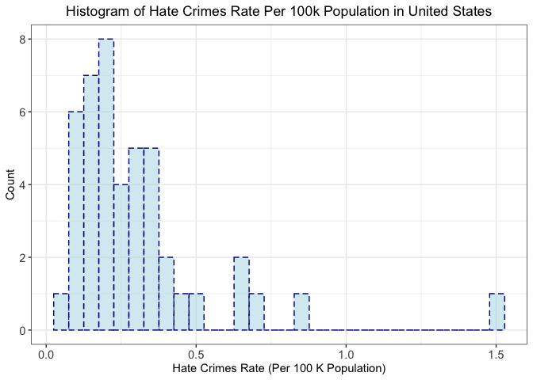
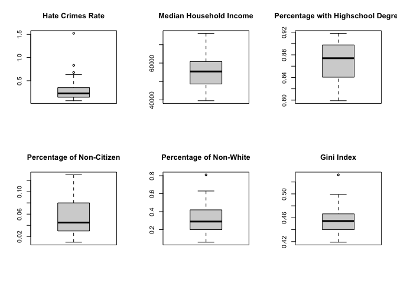
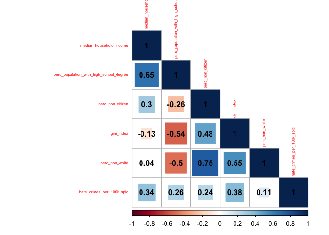
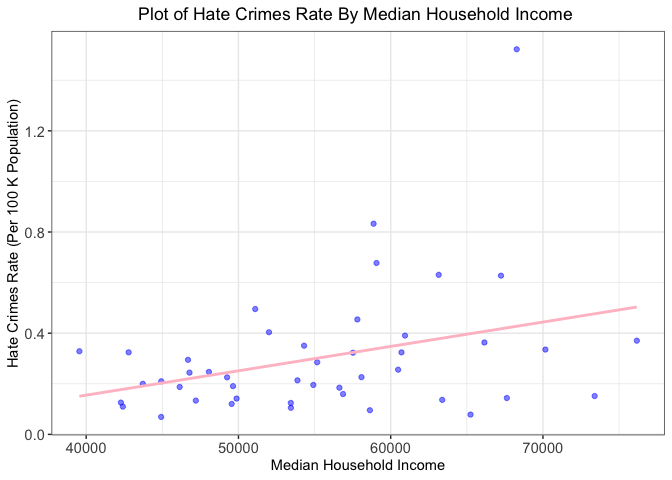
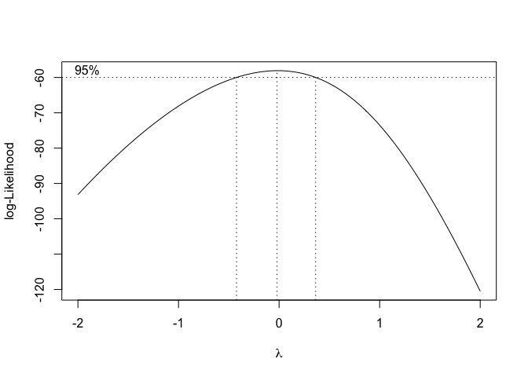
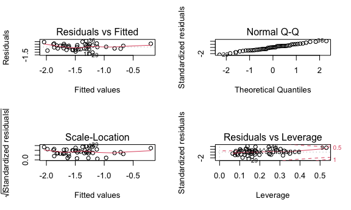
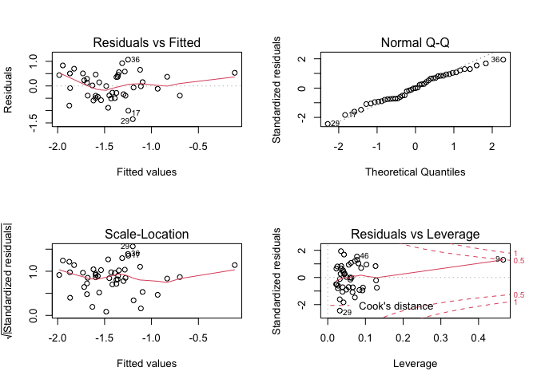
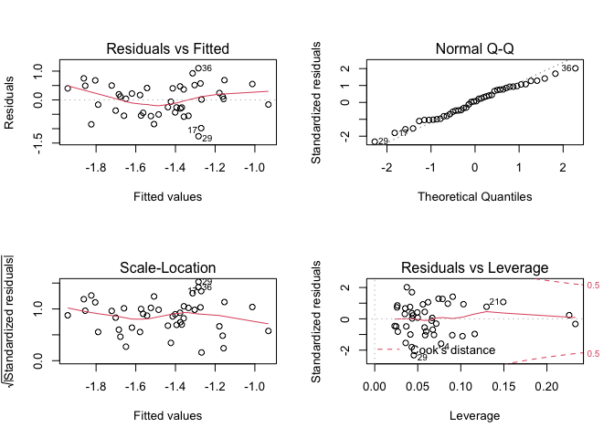

BM1 final project
================

    ## 'data.frame':    48 obs. of  9 variables:
    ##  $ state                                  : chr  "Alabama" "Alaska" "Arizona" "Arkansas" ...
    ##  $ unemployment                           : Factor w/ 2 levels "low","high": 2 2 2 2 2 1 2 1 2 2 ...
    ##  $ urbanization                           : Factor w/ 2 levels "low","high": 1 1 2 1 2 2 2 2 2 2 ...
    ##  $ median_household_income                : int  42278 67629 49254 44922 60487 60940 70161 57522 68277 46140 ...
    ##  $ perc_population_with_high_school_degree: num  0.821 0.914 0.842 0.824 0.806 0.893 0.886 0.874 0.871 0.853 ...
    ##  $ perc_non_citizen                       : num  0.02 0.04 0.1 0.04 0.13 0.06 0.06 0.05 0.11 0.09 ...
    ##  $ gini_index                             : num  0.472 0.422 0.455 0.458 0.471 0.457 0.486 0.44 0.532 0.474 ...
    ##  $ perc_non_white                         : num  0.35 0.42 0.49 0.26 0.61 0.31 0.3 0.37 0.63 0.46 ...
    ##  $ hate_crimes_per_100k_splc              : num  0.1258 0.1437 0.2253 0.0691 0.2558 ...

## Descriptive statistics+Graphs

    ## 
    ## Table: Descriptive Characteristics of Study Sample, Hate Crimes Occurring in the United States (By State)
    ## 
    ## |                                                         |   Overall (N=48)    |
    ## |:--------------------------------------------------------|:-------------------:|
    ## |Hate crime rate per 100k population                      |                     |
    ## |-  Mean/SD                                               |     0.30 (0.25)     |
    ## |-  Median                                                |        0.23         |
    ## |-  IQR                                                   |        0.21         |
    ## |-  Min - Max                                             |     0.07 - 1.52     |
    ## |-  Missing                                               |          3          |
    ## |Level of state unemployment                              |                     |
    ## |-  low                                                   |     25 (52.1%)      |
    ## |-  high                                                  |     23 (47.9%)      |
    ## |-  Missing                                               |          0          |
    ## |Level of state urbanization                              |                     |
    ## |-  low                                                   |     24 (50.0%)      |
    ## |-  high                                                  |     24 (50.0%)      |
    ## |-  Missing                                               |          0          |
    ## |Median household income per state                        |                     |
    ## |-  Mean/SD                                               | 55752.50 (9016.68)  |
    ## |-  Median                                                |      55431.50       |
    ## |-  IQR                                                   |      11827.00       |
    ## |-  Min - Max                                             | 39552.00 - 76165.00 |
    ## |-  Missing                                               |          0          |
    ## |Percentage of adults (>25 yrs) with a high school degree |                     |
    ## |-  Mean/SD                                               |     0.87 (0.03)     |
    ## |-  Median                                                |        0.87         |
    ## |-  IQR                                                   |        0.06         |
    ## |-  Min - Max                                             |     0.80 - 0.92     |
    ## |-  Missing                                               |          0          |
    ## |Percentage of population that are not US citizens        |                     |
    ## |-  Mean/SD                                               |     0.05 (0.03)     |
    ## |-  Median                                                |        0.04         |
    ## |-  IQR                                                   |        0.05         |
    ## |-  Min - Max                                             |     0.01 - 0.13     |
    ## |-  Missing                                               |          0          |
    ## |Gini index                                               |                     |
    ## |-  Mean/SD                                               |     0.45 (0.02)     |
    ## |-  Median                                                |        0.45         |
    ## |-  IQR                                                   |        0.03         |
    ## |-  Min - Max                                             |     0.42 - 0.53     |
    ## |-  Missing                                               |          0          |
    ## |Percentage of population that are non-white              |                     |
    ## |-  Mean/SD                                               |     0.32 (0.16)     |
    ## |-  Median                                                |        0.29         |
    ## |-  IQR                                                   |        0.22         |
    ## |-  Min - Max                                             |     0.06 - 0.81     |
    ## |-  Missing                                               |          0          |

<!-- --><!-- -->

## Varible Selection

<!-- -->

    ##                                         median_household_income
    ## median_household_income                                    1.00
    ## perc_population_with_high_school_degree                    0.65
    ## perc_non_citizen                                           0.30
    ## gini_index                                                -0.13
    ## perc_non_white                                             0.04
    ## hate_crimes_per_100k_splc                                  0.34
    ##                                         perc_population_with_high_school_degree
    ## median_household_income                                                    0.65
    ## perc_population_with_high_school_degree                                    1.00
    ## perc_non_citizen                                                          -0.26
    ## gini_index                                                                -0.54
    ## perc_non_white                                                            -0.50
    ## hate_crimes_per_100k_splc                                                  0.26
    ##                                         perc_non_citizen gini_index
    ## median_household_income                             0.30      -0.13
    ## perc_population_with_high_school_degree            -0.26      -0.54
    ## perc_non_citizen                                    1.00       0.48
    ## gini_index                                          0.48       1.00
    ## perc_non_white                                      0.75       0.55
    ## hate_crimes_per_100k_splc                           0.24       0.38
    ##                                         perc_non_white
    ## median_household_income                           0.04
    ## perc_population_with_high_school_degree          -0.50
    ## perc_non_citizen                                  0.75
    ## gini_index                                        0.55
    ## perc_non_white                                    1.00
    ## hate_crimes_per_100k_splc                         0.11
    ##                                         hate_crimes_per_100k_splc
    ## median_household_income                                      0.34
    ## perc_population_with_high_school_degree                      0.26
    ## perc_non_citizen                                             0.24
    ## gini_index                                                   0.38
    ## perc_non_white                                               0.11
    ## hate_crimes_per_100k_splc                                    1.00

median\_household\_income and
perc\_population\_with\_high\_school\_degree may highly correlated.
perc\_non\_white and perc\_non\_cizen may highly correlated.

``` r
# 2. Simple linear regression model: hate crime rates~ gini index
ggplot(data=crimes,aes(x=gini_index,y=hate_crimes_per_100k_splc))+
geom_point(color="blue",alpha=0.5) +geom_smooth(method="lm",se=F,color="pink")+labs(title="Plot of Hate Crimes Rate By Gini Index",y="Hate Crimes Rate (Per 100 K Population)", x = "Gini Index")+mytheme
```

    ## `geom_smooth()` using formula 'y ~ x'

    ## Warning: Removed 3 rows containing non-finite values (stat_smooth).

    ## Warning: Removed 3 rows containing missing values (geom_point).

<!-- -->

``` r
res_crimes_gini<-lm(hate_crimes_per_100k_splc~gini_index,data=crimes)
summary(res_crimes_gini)
```

    ## 
    ## Call:
    ## lm(formula = hate_crimes_per_100k_splc ~ gini_index, data = crimes)
    ## 
    ## Residuals:
    ##      Min       1Q   Median       3Q      Max 
    ## -0.28113 -0.14973 -0.04568  0.07525  0.87041 
    ## 
    ## Coefficients:
    ##             Estimate Std. Error t value Pr(>|t|)   
    ## (Intercept)  -1.7844     0.7742  -2.305  0.02608 * 
    ## gini_index    4.5794     1.6973   2.698  0.00992 **
    ## ---
    ## Signif. codes:  0 '***' 0.001 '**' 0.01 '*' 0.05 '.' 0.1 ' ' 1
    ## 
    ## Residual standard error: 0.2353 on 43 degrees of freedom
    ##   (3 observations deleted due to missingness)
    ## Multiple R-squared:  0.1448, Adjusted R-squared:  0.1249 
    ## F-statistic:  7.28 on 1 and 43 DF,  p-value: 0.009924

``` r
# 3. Varibale Selection- backwards selection
res1 <- lm(hate_crimes_per_100k_splc ~ .-state, data=crimes)
summary(res1)
```

    ## 
    ## Call:
    ## lm(formula = hate_crimes_per_100k_splc ~ . - state, data = crimes)
    ## 
    ## Residuals:
    ##      Min       1Q   Median       3Q      Max 
    ## -0.36552 -0.10314 -0.01316  0.09731  0.51389 
    ## 
    ## Coefficients:
    ##                                           Estimate Std. Error t value Pr(>|t|)
    ## (Intercept)                             -8.250e+00  1.897e+00  -4.349 0.000103
    ## unemploymenthigh                        -1.307e-02  7.173e-02  -0.182 0.856425
    ## urbanizationhigh                        -3.309e-02  8.475e-02  -0.390 0.698475
    ## median_household_income                 -1.504e-06  5.961e-06  -0.252 0.802193
    ## perc_population_with_high_school_degree  5.382e+00  1.835e+00   2.933 0.005735
    ## perc_non_citizen                         1.233e+00  1.877e+00   0.657 0.515332
    ## gini_index                               8.624e+00  1.973e+00   4.370 9.67e-05
    ## perc_non_white                          -5.842e-03  3.673e-01  -0.016 0.987396
    ##                                            
    ## (Intercept)                             ***
    ## unemploymenthigh                           
    ## urbanizationhigh                           
    ## median_household_income                    
    ## perc_population_with_high_school_degree ** 
    ## perc_non_citizen                           
    ## gini_index                              ***
    ## perc_non_white                             
    ## ---
    ## Signif. codes:  0 '***' 0.001 '**' 0.01 '*' 0.05 '.' 0.1 ' ' 1
    ## 
    ## Residual standard error: 0.2014 on 37 degrees of freedom
    ##   (3 observations deleted due to missingness)
    ## Multiple R-squared:  0.461,  Adjusted R-squared:  0.3591 
    ## F-statistic: 4.521 on 7 and 37 DF,  p-value: 0.001007

``` r
step1<-update(res1, . ~ . -perc_non_white)
summary(step1)
```

    ## 
    ## Call:
    ## lm(formula = hate_crimes_per_100k_splc ~ unemployment + urbanization + 
    ##     median_household_income + perc_population_with_high_school_degree + 
    ##     perc_non_citizen + gini_index, data = crimes)
    ## 
    ## Residuals:
    ##      Min       1Q   Median       3Q      Max 
    ## -0.36516 -0.10256 -0.01341  0.09717  0.51338 
    ## 
    ## Coefficients:
    ##                                           Estimate Std. Error t value Pr(>|t|)
    ## (Intercept)                             -8.257e+00  1.823e+00  -4.529 5.71e-05
    ## unemploymenthigh                        -1.334e-02  6.879e-02  -0.194  0.84729
    ## urbanizationhigh                        -3.301e-02  8.349e-02  -0.395  0.69478
    ## median_household_income                 -1.518e-06  5.818e-06  -0.261  0.79558
    ## perc_population_with_high_school_degree  5.391e+00  1.721e+00   3.133  0.00333
    ## perc_non_citizen                         1.217e+00  1.554e+00   0.783  0.43846
    ## gini_index                               8.621e+00  1.941e+00   4.441 7.48e-05
    ##                                            
    ## (Intercept)                             ***
    ## unemploymenthigh                           
    ## urbanizationhigh                           
    ## median_household_income                    
    ## perc_population_with_high_school_degree ** 
    ## perc_non_citizen                           
    ## gini_index                              ***
    ## ---
    ## Signif. codes:  0 '***' 0.001 '**' 0.01 '*' 0.05 '.' 0.1 ' ' 1
    ## 
    ## Residual standard error: 0.1987 on 38 degrees of freedom
    ##   (3 observations deleted due to missingness)
    ## Multiple R-squared:  0.461,  Adjusted R-squared:  0.3759 
    ## F-statistic: 5.417 on 6 and 38 DF,  p-value: 0.0003982

``` r
step2<-update(step1, . ~ . -unemployment)
summary(step2)
```

    ## 
    ## Call:
    ## lm(formula = hate_crimes_per_100k_splc ~ urbanization + median_household_income + 
    ##     perc_population_with_high_school_degree + perc_non_citizen + 
    ##     gini_index, data = crimes)
    ## 
    ## Residuals:
    ##      Min       1Q   Median       3Q      Max 
    ## -0.37123 -0.10827 -0.01111  0.09475  0.51139 
    ## 
    ## Coefficients:
    ##                                           Estimate Std. Error t value Pr(>|t|)
    ## (Intercept)                             -8.284e+00  1.795e+00  -4.616 4.18e-05
    ## urbanizationhigh                        -3.477e-02  8.197e-02  -0.424  0.67371
    ## median_household_income                 -1.438e-06  5.732e-06  -0.251  0.80317
    ## perc_population_with_high_school_degree  5.443e+00  1.678e+00   3.243  0.00243
    ## perc_non_citizen                         1.211e+00  1.534e+00   0.789  0.43462
    ## gini_index                               8.560e+00  1.892e+00   4.525 5.53e-05
    ##                                            
    ## (Intercept)                             ***
    ## urbanizationhigh                           
    ## median_household_income                    
    ## perc_population_with_high_school_degree ** 
    ## perc_non_citizen                           
    ## gini_index                              ***
    ## ---
    ## Signif. codes:  0 '***' 0.001 '**' 0.01 '*' 0.05 '.' 0.1 ' ' 1
    ## 
    ## Residual standard error: 0.1963 on 39 degrees of freedom
    ##   (3 observations deleted due to missingness)
    ## Multiple R-squared:  0.4605, Adjusted R-squared:  0.3913 
    ## F-statistic: 6.657 on 5 and 39 DF,  p-value: 0.0001437

``` r
step3<-update(step2, . ~ . -median_household_income) 
summary(step3)
```

    ## 
    ## Call:
    ## lm(formula = hate_crimes_per_100k_splc ~ urbanization + perc_population_with_high_school_degree + 
    ##     perc_non_citizen + gini_index, data = crimes)
    ## 
    ## Residuals:
    ##      Min       1Q   Median       3Q      Max 
    ## -0.37212 -0.11590 -0.01221  0.09509  0.50813 
    ## 
    ## Coefficients:
    ##                                         Estimate Std. Error t value Pr(>|t|)
    ## (Intercept)                             -8.05395    1.52469  -5.282 4.80e-06
    ## urbanizationhigh                        -0.03635    0.08076  -0.450    0.655
    ## perc_population_with_high_school_degree  5.12116    1.06948   4.788 2.32e-05
    ## perc_non_citizen                         1.02954    1.33670   0.770    0.446
    ## gini_index                               8.51632    1.86148   4.575 4.54e-05
    ##                                            
    ## (Intercept)                             ***
    ## urbanizationhigh                           
    ## perc_population_with_high_school_degree ***
    ## perc_non_citizen                           
    ## gini_index                              ***
    ## ---
    ## Signif. codes:  0 '***' 0.001 '**' 0.01 '*' 0.05 '.' 0.1 ' ' 1
    ## 
    ## Residual standard error: 0.194 on 40 degrees of freedom
    ##   (3 observations deleted due to missingness)
    ## Multiple R-squared:  0.4596, Adjusted R-squared:  0.4056 
    ## F-statistic: 8.505 on 4 and 40 DF,  p-value: 4.596e-05

``` r
step4<-update(step3, . ~ . -perc_non_citizen) 
summary(step4)
```

    ## 
    ## Call:
    ## lm(formula = hate_crimes_per_100k_splc ~ urbanization + perc_population_with_high_school_degree + 
    ##     gini_index, data = crimes)
    ## 
    ## Residuals:
    ##      Min       1Q   Median       3Q      Max 
    ## -0.33530 -0.11832 -0.03147  0.11493  0.52466 
    ## 
    ## Coefficients:
    ##                                          Estimate Std. Error t value Pr(>|t|)
    ## (Intercept)                             -8.095846   1.516143  -5.340 3.74e-06
    ## urbanizationhigh                         0.001113   0.064154   0.017    0.986
    ## perc_population_with_high_school_degree  5.056796   1.060911   4.766 2.37e-05
    ## gini_index                               8.811852   1.812445   4.862 1.75e-05
    ##                                            
    ## (Intercept)                             ***
    ## urbanizationhigh                           
    ## perc_population_with_high_school_degree ***
    ## gini_index                              ***
    ## ---
    ## Signif. codes:  0 '***' 0.001 '**' 0.01 '*' 0.05 '.' 0.1 ' ' 1
    ## 
    ## Residual standard error: 0.193 on 41 degrees of freedom
    ##   (3 observations deleted due to missingness)
    ## Multiple R-squared:  0.4516, Adjusted R-squared:  0.4115 
    ## F-statistic: 11.25 on 3 and 41 DF,  p-value: 1.61e-05

``` r
step5<-update(step4, . ~ . -urbanization)
summary(step5)
```

    ## 
    ## Call:
    ## lm(formula = hate_crimes_per_100k_splc ~ perc_population_with_high_school_degree + 
    ##     gini_index, data = crimes)
    ## 
    ## Residuals:
    ##      Min       1Q   Median       3Q      Max 
    ## -0.33490 -0.11891 -0.03105  0.11430  0.52418 
    ## 
    ## Coefficients:
    ##                                         Estimate Std. Error t value Pr(>|t|)
    ## (Intercept)                               -8.103      1.447  -5.601 1.48e-06
    ## perc_population_with_high_school_degree    5.059      1.044   4.847 1.74e-05
    ## gini_index                                 8.825      1.630   5.413 2.76e-06
    ##                                            
    ## (Intercept)                             ***
    ## perc_population_with_high_school_degree ***
    ## gini_index                              ***
    ## ---
    ## Signif. codes:  0 '***' 0.001 '**' 0.01 '*' 0.05 '.' 0.1 ' ' 1
    ## 
    ## Residual standard error: 0.1907 on 42 degrees of freedom
    ##   (3 observations deleted due to missingness)
    ## Multiple R-squared:  0.4516, Adjusted R-squared:  0.4255 
    ## F-statistic: 17.29 on 2 and 42 DF,  p-value: 3.32e-06

``` r
multi_fit1<-lm(hate_crimes_per_100k_splc~perc_population_with_high_school_degree+gini_index,data=crimes)
summary(multi_fit1)
```

    ## 
    ## Call:
    ## lm(formula = hate_crimes_per_100k_splc ~ perc_population_with_high_school_degree + 
    ##     gini_index, data = crimes)
    ## 
    ## Residuals:
    ##      Min       1Q   Median       3Q      Max 
    ## -0.33490 -0.11891 -0.03105  0.11430  0.52418 
    ## 
    ## Coefficients:
    ##                                         Estimate Std. Error t value Pr(>|t|)
    ## (Intercept)                               -8.103      1.447  -5.601 1.48e-06
    ## perc_population_with_high_school_degree    5.059      1.044   4.847 1.74e-05
    ## gini_index                                 8.825      1.630   5.413 2.76e-06
    ##                                            
    ## (Intercept)                             ***
    ## perc_population_with_high_school_degree ***
    ## gini_index                              ***
    ## ---
    ## Signif. codes:  0 '***' 0.001 '**' 0.01 '*' 0.05 '.' 0.1 ' ' 1
    ## 
    ## Residual standard error: 0.1907 on 42 degrees of freedom
    ##   (3 observations deleted due to missingness)
    ## Multiple R-squared:  0.4516, Adjusted R-squared:  0.4255 
    ## F-statistic: 17.29 on 2 and 42 DF,  p-value: 3.32e-06

``` r
# 4. Criterion Selection
best <- function(model, ...) 
{
  subsets <- regsubsets(formula(model), model.frame(model), ...)
  subsets <- with(summary(subsets),
                  cbind(p = as.numeric(rownames(which)), which, rss, rsq, adjr2, cp, bic))
  
  return(subsets)
}  


round(best(multi_fit1, nbest = 1), 3) # chose model2 with the minimum cp, BIC and highest adjusted R2
```

    ##   p (Intercept) perc_population_with_high_school_degree gini_index   rss   rsq
    ## 1 1           1                                       0          1 2.381 0.145
    ## 2 2           1                                       1          1 1.527 0.452
    ##   adjr2     cp     bic
    ## 1 0.125 24.498   0.575
    ## 2 0.425  3.000 -15.613

### just one step to get best fit.

``` r
crimes = 
  crimes %>% 
  subset(select = c(-state))

model_fit = 
  lm(hate_crimes_per_100k_splc ~., data = crimes) %>% 
  step(direction = "both")
```

    ## Start:  AIC=-137.03
    ## hate_crimes_per_100k_splc ~ unemployment + urbanization + median_household_income + 
    ##     perc_population_with_high_school_degree + perc_non_citizen + 
    ##     gini_index + perc_non_white
    ## 
    ##                                           Df Sum of Sq    RSS     AIC
    ## - perc_non_white                           1   0.00001 1.5008 -139.03
    ## - unemployment                             1   0.00135 1.5021 -138.99
    ## - median_household_income                  1   0.00258 1.5034 -138.95
    ## - urbanization                             1   0.00618 1.5070 -138.85
    ## - perc_non_citizen                         1   0.01750 1.5183 -138.51
    ## <none>                                                 1.5008 -137.03
    ## - perc_population_with_high_school_degree  1   0.34889 1.8497 -129.62
    ## - gini_index                               1   0.77465 2.2754 -120.30
    ## 
    ## Step:  AIC=-139.03
    ## hate_crimes_per_100k_splc ~ unemployment + urbanization + median_household_income + 
    ##     perc_population_with_high_school_degree + perc_non_citizen + 
    ##     gini_index
    ## 
    ##                                           Df Sum of Sq    RSS     AIC
    ## - unemployment                             1   0.00148 1.5023 -140.99
    ## - median_household_income                  1   0.00269 1.5035 -140.95
    ## - urbanization                             1   0.00617 1.5070 -140.85
    ## - perc_non_citizen                         1   0.02422 1.5250 -140.31
    ## <none>                                                 1.5008 -139.03
    ## + perc_non_white                           1   0.00001 1.5008 -137.03
    ## - perc_population_with_high_school_degree  1   0.38759 1.8884 -130.69
    ## - gini_index                               1   0.77888 2.2797 -122.22
    ## 
    ## Step:  AIC=-140.99
    ## hate_crimes_per_100k_splc ~ urbanization + median_household_income + 
    ##     perc_population_with_high_school_degree + perc_non_citizen + 
    ##     gini_index
    ## 
    ##                                           Df Sum of Sq    RSS     AIC
    ## - median_household_income                  1   0.00243 1.5047 -142.91
    ## - urbanization                             1   0.00693 1.5092 -142.78
    ## - perc_non_citizen                         1   0.02401 1.5263 -142.27
    ## <none>                                                 1.5023 -140.99
    ## + unemployment                             1   0.00148 1.5008 -139.03
    ## + perc_non_white                           1   0.00015 1.5021 -138.99
    ## - perc_population_with_high_school_degree  1   0.40517 1.9074 -132.24
    ## - gini_index                               1   0.78876 2.2910 -124.00
    ## 
    ## Step:  AIC=-142.91
    ## hate_crimes_per_100k_splc ~ urbanization + perc_population_with_high_school_degree + 
    ##     perc_non_citizen + gini_index
    ## 
    ##                                           Df Sum of Sq    RSS     AIC
    ## - urbanization                             1   0.00762 1.5123 -144.69
    ## - perc_non_citizen                         1   0.02232 1.5270 -144.25
    ## <none>                                                 1.5047 -142.91
    ## + median_household_income                  1   0.00243 1.5023 -140.99
    ## + unemployment                             1   0.00122 1.5035 -140.95
    ## + perc_non_white                           1   0.00034 1.5044 -140.92
    ## - gini_index                               1   0.78737 2.2921 -125.97
    ## - perc_population_with_high_school_degree  1   0.86254 2.3672 -124.52
    ## 
    ## Step:  AIC=-144.69
    ## hate_crimes_per_100k_splc ~ perc_population_with_high_school_degree + 
    ##     perc_non_citizen + gini_index
    ## 
    ##                                           Df Sum of Sq    RSS     AIC
    ## - perc_non_citizen                         1   0.01471 1.5270 -146.25
    ## <none>                                                 1.5123 -144.69
    ## + urbanization                             1   0.00762 1.5047 -142.91
    ## + median_household_income                  1   0.00311 1.5092 -142.78
    ## + unemployment                             1   0.00192 1.5104 -142.74
    ## + perc_non_white                           1   0.00028 1.5120 -142.69
    ## - gini_index                               1   0.78804 2.3004 -127.81
    ## - perc_population_with_high_school_degree  1   0.85561 2.3679 -126.51
    ## 
    ## Step:  AIC=-146.25
    ## hate_crimes_per_100k_splc ~ perc_population_with_high_school_degree + 
    ##     gini_index
    ## 
    ##                                           Df Sum of Sq    RSS     AIC
    ## <none>                                                 1.5270 -146.25
    ## + perc_non_citizen                         1   0.01471 1.5123 -144.69
    ## + perc_non_white                           1   0.00522 1.5218 -144.40
    ## + unemployment                             1   0.00136 1.5257 -144.29
    ## + median_household_income                  1   0.00068 1.5263 -144.27
    ## + urbanization                             1   0.00001 1.5270 -144.25
    ## - perc_population_with_high_school_degree  1   0.85432 2.3813 -128.25
    ## - gini_index                               1   1.06513 2.5922 -124.44

``` r
summary(model_fit)   ### get same model with Mumei
```

    ## 
    ## Call:
    ## lm(formula = hate_crimes_per_100k_splc ~ perc_population_with_high_school_degree + 
    ##     gini_index, data = crimes)
    ## 
    ## Residuals:
    ##      Min       1Q   Median       3Q      Max 
    ## -0.33490 -0.11891 -0.03105  0.11430  0.52418 
    ## 
    ## Coefficients:
    ##                                         Estimate Std. Error t value Pr(>|t|)
    ## (Intercept)                               -8.103      1.447  -5.601 1.48e-06
    ## perc_population_with_high_school_degree    5.059      1.044   4.847 1.74e-05
    ## gini_index                                 8.825      1.630   5.413 2.76e-06
    ##                                            
    ## (Intercept)                             ***
    ## perc_population_with_high_school_degree ***
    ## gini_index                              ***
    ## ---
    ## Signif. codes:  0 '***' 0.001 '**' 0.01 '*' 0.05 '.' 0.1 ' ' 1
    ## 
    ## Residual standard error: 0.1907 on 42 degrees of freedom
    ##   (3 observations deleted due to missingness)
    ## Multiple R-squared:  0.4516, Adjusted R-squared:  0.4255 
    ## F-statistic: 17.29 on 2 and 42 DF,  p-value: 3.32e-06

### interaction

``` r
# 5. Check interactions between median income and perc of high school degree
res_interaction<-lm(hate_crimes_per_100k_splc~median_household_income*perc_population_with_high_school_degree+gini_index,data=crimes)
summary(res_interaction) # No-interaction between income and high school degree
```

    ## 
    ## Call:
    ## lm(formula = hate_crimes_per_100k_splc ~ median_household_income * 
    ##     perc_population_with_high_school_degree + gini_index, data = crimes)
    ## 
    ## Residuals:
    ##      Min       1Q   Median       3Q      Max 
    ## -0.34026 -0.11791 -0.03244  0.11251  0.52198 
    ## 
    ## Coefficients:
    ##                                                                   Estimate
    ## (Intercept)                                                     -7.067e+00
    ## median_household_income                                         -1.707e-05
    ## perc_population_with_high_school_degree                          3.837e+00
    ## gini_index                                                       8.801e+00
    ## median_household_income:perc_population_with_high_school_degree  2.033e-05
    ##                                                                 Std. Error
    ## (Intercept)                                                      5.725e+00
    ## median_household_income                                          1.058e-04
    ## perc_population_with_high_school_degree                          6.643e+00
    ## gini_index                                                       1.811e+00
    ## median_household_income:perc_population_with_high_school_degree  1.215e-04
    ##                                                                 t value
    ## (Intercept)                                                      -1.234
    ## median_household_income                                          -0.161
    ## perc_population_with_high_school_degree                           0.578
    ## gini_index                                                        4.859
    ## median_household_income:perc_population_with_high_school_degree   0.167
    ##                                                                 Pr(>|t|)    
    ## (Intercept)                                                        0.224    
    ## median_household_income                                            0.873    
    ## perc_population_with_high_school_degree                            0.567    
    ## gini_index                                                      1.86e-05 ***
    ## median_household_income:perc_population_with_high_school_degree    0.868    
    ## ---
    ## Signif. codes:  0 '***' 0.001 '**' 0.01 '*' 0.05 '.' 0.1 ' ' 1
    ## 
    ## Residual standard error: 0.1953 on 40 degrees of freedom
    ##   (3 observations deleted due to missingness)
    ## Multiple R-squared:  0.4522, Adjusted R-squared:  0.3974 
    ## F-statistic: 8.256 on 4 and 40 DF,  p-value: 5.943e-05

``` r
anova(model_fit, res_interaction)
```

    ## Analysis of Variance Table
    ## 
    ## Model 1: hate_crimes_per_100k_splc ~ perc_population_with_high_school_degree + 
    ##     gini_index
    ## Model 2: hate_crimes_per_100k_splc ~ median_household_income * perc_population_with_high_school_degree + 
    ##     gini_index
    ##   Res.Df    RSS Df Sum of Sq      F Pr(>F)
    ## 1     42 1.5270                           
    ## 2     40 1.5253  2 0.0017498 0.0229 0.9773

``` r
#--------------------------------------------------------------------------------------------------------

# Check interactions between urbanization and gini_index
ggplot(data=crimes,aes(x=gini_index,y=hate_crimes_per_100k_splc,color=urbanization))+
geom_point() +geom_smooth(method="lm",se=F)+labs(title="Plot of Hate Crimes Rate vs Gini index By Urbanization level ",y="Hate Crimes Rate (Per 100 K Population)", x = "Gini index")+mytheme
```

    ## `geom_smooth()` using formula 'y ~ x'

    ## Warning: Removed 3 rows containing non-finite values (stat_smooth).

    ## Warning: Removed 3 rows containing missing values (geom_point).

<!-- -->

``` r
res_interaction2<-lm(hate_crimes_per_100k_splc~perc_population_with_high_school_degree+gini_index*urbanization,data=crimes)
summary(res_interaction2) # No interaction b/w urbanization and gini index
```

    ## 
    ## Call:
    ## lm(formula = hate_crimes_per_100k_splc ~ perc_population_with_high_school_degree + 
    ##     gini_index * urbanization, data = crimes)
    ## 
    ## Residuals:
    ##      Min       1Q   Median       3Q      Max 
    ## -0.33743 -0.12559 -0.02552  0.10649  0.53288 
    ## 
    ## Coefficients:
    ##                                         Estimate Std. Error t value Pr(>|t|)
    ## (Intercept)                              -8.6525     2.6495  -3.266 0.002244
    ## perc_population_with_high_school_degree   5.2314     1.2693   4.121 0.000184
    ## gini_index                                9.7180     3.9664   2.450 0.018755
    ## urbanizationhigh                          0.4743     1.8377   0.258 0.797673
    ## gini_index:urbanizationhigh              -1.0506     4.0781  -0.258 0.798014
    ##                                            
    ## (Intercept)                             ** 
    ## perc_population_with_high_school_degree ***
    ## gini_index                              *  
    ## urbanizationhigh                           
    ## gini_index:urbanizationhigh                
    ## ---
    ## Signif. codes:  0 '***' 0.001 '**' 0.01 '*' 0.05 '.' 0.1 ' ' 1
    ## 
    ## Residual standard error: 0.1952 on 40 degrees of freedom
    ##   (3 observations deleted due to missingness)
    ## Multiple R-squared:  0.4525, Adjusted R-squared:  0.3978 
    ## F-statistic: 8.265 on 4 and 40 DF,  p-value: 5.885e-05

``` r
anova(model_fit, res_interaction2)
```

    ## Analysis of Variance Table
    ## 
    ## Model 1: hate_crimes_per_100k_splc ~ perc_population_with_high_school_degree + 
    ##     gini_index
    ## Model 2: hate_crimes_per_100k_splc ~ perc_population_with_high_school_degree + 
    ##     gini_index * urbanization
    ##   Res.Df    RSS Df Sum of Sq      F Pr(>F)
    ## 1     42 1.5270                           
    ## 2     40 1.5245  2 0.0025408 0.0333 0.9672

``` r
###  Check interactions between perc_non_white and gini_index

res_interaction3<-lm(hate_crimes_per_100k_splc~perc_population_with_high_school_degree+gini_index*perc_non_white,data=crimes)
summary(res_interaction3) 
```

    ## 
    ## Call:
    ## lm(formula = hate_crimes_per_100k_splc ~ perc_population_with_high_school_degree + 
    ##     gini_index * perc_non_white, data = crimes)
    ## 
    ## Residuals:
    ##      Min       1Q   Median       3Q      Max 
    ## -0.29375 -0.14150  0.00895  0.07453  0.50715 
    ## 
    ## Coefficients:
    ##                                         Estimate Std. Error t value Pr(>|t|)
    ## (Intercept)                               -2.453      2.317  -1.059 0.296006
    ## perc_population_with_high_school_degree    3.935      1.089   3.615 0.000832
    ## gini_index                                -1.560      3.757  -0.415 0.680128
    ## perc_non_white                           -10.655      3.597  -2.962 0.005120
    ## gini_index:perc_non_white                 23.502      7.851   2.993 0.004712
    ##                                            
    ## (Intercept)                                
    ## perc_population_with_high_school_degree ***
    ## gini_index                                 
    ## perc_non_white                          ** 
    ## gini_index:perc_non_white               ** 
    ## ---
    ## Signif. codes:  0 '***' 0.001 '**' 0.01 '*' 0.05 '.' 0.1 ' ' 1
    ## 
    ## Residual standard error: 0.1763 on 40 degrees of freedom
    ##   (3 observations deleted due to missingness)
    ## Multiple R-squared:  0.5535, Adjusted R-squared:  0.5088 
    ## F-statistic:  12.4 on 4 and 40 DF,  p-value: 1.197e-06

``` r
anova(model_fit, res_interaction3)#exist interaction b/w perc_non_white and gini index
```

    ## Analysis of Variance Table
    ## 
    ## Model 1: hate_crimes_per_100k_splc ~ perc_population_with_high_school_degree + 
    ##     gini_index
    ## Model 2: hate_crimes_per_100k_splc ~ perc_population_with_high_school_degree + 
    ##     gini_index * perc_non_white
    ##   Res.Df    RSS Df Sum of Sq      F  Pr(>F)  
    ## 1     42 1.5270                              
    ## 2     40 1.2433  2   0.28374 4.5643 0.01639 *
    ## ---
    ## Signif. codes:  0 '***' 0.001 '**' 0.01 '*' 0.05 '.' 0.1 ' ' 1

The anova p-value of potential interaction between urbanization and gini
index,and median income and perc of high school degree turn out to not
be statistically significant. So even though the estimated slopes in the
interaction model look very different, our estimates are quite variable,
so we don’t have enough evidence to conclude that the interaction term
(different slopes) is providing significant additional explanatory power
over the simpler
perc\_population\_with\_high\_school\_degree+gini\_index. (do not just
copy this sentence, paraphrase it)

There is an significant interaction between perc\_non\_white and gini
index

### find confounder

``` r
reg_conf1 = lm(hate_crimes_per_100k_splc~perc_population_with_high_school_degree+gini_index + unemployment, data=crimes)
summary(model_fit)
```

    ## 
    ## Call:
    ## lm(formula = hate_crimes_per_100k_splc ~ perc_population_with_high_school_degree + 
    ##     gini_index, data = crimes)
    ## 
    ## Residuals:
    ##      Min       1Q   Median       3Q      Max 
    ## -0.33490 -0.11891 -0.03105  0.11430  0.52418 
    ## 
    ## Coefficients:
    ##                                         Estimate Std. Error t value Pr(>|t|)
    ## (Intercept)                               -8.103      1.447  -5.601 1.48e-06
    ## perc_population_with_high_school_degree    5.059      1.044   4.847 1.74e-05
    ## gini_index                                 8.825      1.630   5.413 2.76e-06
    ##                                            
    ## (Intercept)                             ***
    ## perc_population_with_high_school_degree ***
    ## gini_index                              ***
    ## ---
    ## Signif. codes:  0 '***' 0.001 '**' 0.01 '*' 0.05 '.' 0.1 ' ' 1
    ## 
    ## Residual standard error: 0.1907 on 42 degrees of freedom
    ##   (3 observations deleted due to missingness)
    ## Multiple R-squared:  0.4516, Adjusted R-squared:  0.4255 
    ## F-statistic: 17.29 on 2 and 42 DF,  p-value: 3.32e-06

``` r
summary(reg_conf1) ### coefficient changes for gini and high school degree is smaller than 1%, unemployment is not a confounder
```

    ## 
    ## Call:
    ## lm(formula = hate_crimes_per_100k_splc ~ perc_population_with_high_school_degree + 
    ##     gini_index + unemployment, data = crimes)
    ## 
    ## Residuals:
    ##      Min       1Q   Median       3Q      Max 
    ## -0.32884 -0.11607 -0.02803  0.11647  0.52520 
    ## 
    ## Coefficients:
    ##                                         Estimate Std. Error t value Pr(>|t|)
    ## (Intercept)                             -8.07316    1.47154  -5.486 2.32e-06
    ## perc_population_with_high_school_degree  4.99442    1.10767   4.509 5.36e-05
    ## gini_index                               8.89617    1.69110   5.261 4.83e-06
    ## unemploymenthigh                        -0.01265    0.06614  -0.191    0.849
    ##                                            
    ## (Intercept)                             ***
    ## perc_population_with_high_school_degree ***
    ## gini_index                              ***
    ## unemploymenthigh                           
    ## ---
    ## Signif. codes:  0 '***' 0.001 '**' 0.01 '*' 0.05 '.' 0.1 ' ' 1
    ## 
    ## Residual standard error: 0.1929 on 41 degrees of freedom
    ##   (3 observations deleted due to missingness)
    ## Multiple R-squared:  0.4521, Adjusted R-squared:  0.412 
    ## F-statistic: 11.28 on 3 and 41 DF,  p-value: 1.582e-05

``` r
reg_conf2 = lm(hate_crimes_per_100k_splc~perc_population_with_high_school_degree+gini_index + urbanization, data=crimes)
summary(model_fit)
```

    ## 
    ## Call:
    ## lm(formula = hate_crimes_per_100k_splc ~ perc_population_with_high_school_degree + 
    ##     gini_index, data = crimes)
    ## 
    ## Residuals:
    ##      Min       1Q   Median       3Q      Max 
    ## -0.33490 -0.11891 -0.03105  0.11430  0.52418 
    ## 
    ## Coefficients:
    ##                                         Estimate Std. Error t value Pr(>|t|)
    ## (Intercept)                               -8.103      1.447  -5.601 1.48e-06
    ## perc_population_with_high_school_degree    5.059      1.044   4.847 1.74e-05
    ## gini_index                                 8.825      1.630   5.413 2.76e-06
    ##                                            
    ## (Intercept)                             ***
    ## perc_population_with_high_school_degree ***
    ## gini_index                              ***
    ## ---
    ## Signif. codes:  0 '***' 0.001 '**' 0.01 '*' 0.05 '.' 0.1 ' ' 1
    ## 
    ## Residual standard error: 0.1907 on 42 degrees of freedom
    ##   (3 observations deleted due to missingness)
    ## Multiple R-squared:  0.4516, Adjusted R-squared:  0.4255 
    ## F-statistic: 17.29 on 2 and 42 DF,  p-value: 3.32e-06

``` r
summary(reg_conf2) ### coefficient changes for gini and high school degree is smaller than 1%, urbanization is not a confounder
```

    ## 
    ## Call:
    ## lm(formula = hate_crimes_per_100k_splc ~ perc_population_with_high_school_degree + 
    ##     gini_index + urbanization, data = crimes)
    ## 
    ## Residuals:
    ##      Min       1Q   Median       3Q      Max 
    ## -0.33530 -0.11832 -0.03147  0.11493  0.52466 
    ## 
    ## Coefficients:
    ##                                          Estimate Std. Error t value Pr(>|t|)
    ## (Intercept)                             -8.095846   1.516143  -5.340 3.74e-06
    ## perc_population_with_high_school_degree  5.056796   1.060911   4.766 2.37e-05
    ## gini_index                               8.811852   1.812445   4.862 1.75e-05
    ## urbanizationhigh                         0.001113   0.064154   0.017    0.986
    ##                                            
    ## (Intercept)                             ***
    ## perc_population_with_high_school_degree ***
    ## gini_index                              ***
    ## urbanizationhigh                           
    ## ---
    ## Signif. codes:  0 '***' 0.001 '**' 0.01 '*' 0.05 '.' 0.1 ' ' 1
    ## 
    ## Residual standard error: 0.193 on 41 degrees of freedom
    ##   (3 observations deleted due to missingness)
    ## Multiple R-squared:  0.4516, Adjusted R-squared:  0.4115 
    ## F-statistic: 11.25 on 3 and 41 DF,  p-value: 1.61e-05

``` r
reg_conf3 = lm(hate_crimes_per_100k_splc~perc_population_with_high_school_degree+gini_index + median_household_income, data=crimes)
summary(model_fit)
```

    ## 
    ## Call:
    ## lm(formula = hate_crimes_per_100k_splc ~ perc_population_with_high_school_degree + 
    ##     gini_index, data = crimes)
    ## 
    ## Residuals:
    ##      Min       1Q   Median       3Q      Max 
    ## -0.33490 -0.11891 -0.03105  0.11430  0.52418 
    ## 
    ## Coefficients:
    ##                                         Estimate Std. Error t value Pr(>|t|)
    ## (Intercept)                               -8.103      1.447  -5.601 1.48e-06
    ## perc_population_with_high_school_degree    5.059      1.044   4.847 1.74e-05
    ## gini_index                                 8.825      1.630   5.413 2.76e-06
    ##                                            
    ## (Intercept)                             ***
    ## perc_population_with_high_school_degree ***
    ## gini_index                              ***
    ## ---
    ## Signif. codes:  0 '***' 0.001 '**' 0.01 '*' 0.05 '.' 0.1 ' ' 1
    ## 
    ## Residual standard error: 0.1907 on 42 degrees of freedom
    ##   (3 observations deleted due to missingness)
    ## Multiple R-squared:  0.4516, Adjusted R-squared:  0.4255 
    ## F-statistic: 17.29 on 2 and 42 DF,  p-value: 3.32e-06

``` r
summary(reg_conf3)
```

    ## 
    ## Call:
    ## lm(formula = hate_crimes_per_100k_splc ~ perc_population_with_high_school_degree + 
    ##     gini_index + median_household_income, data = crimes)
    ## 
    ## Residuals:
    ##      Min       1Q   Median       3Q      Max 
    ## -0.33932 -0.12201 -0.02784  0.11448  0.52305 
    ## 
    ## Coefficients:
    ##                                           Estimate Std. Error t value Pr(>|t|)
    ## (Intercept)                             -7.979e+00  1.723e+00  -4.630 3.65e-05
    ## perc_population_with_high_school_degree  4.920e+00  1.469e+00   3.349  0.00175
    ## gini_index                               8.743e+00  1.757e+00   4.976 1.21e-05
    ## median_household_income                  6.158e-07  4.546e-06   0.135  0.89290
    ##                                            
    ## (Intercept)                             ***
    ## perc_population_with_high_school_degree ** 
    ## gini_index                              ***
    ## median_household_income                    
    ## ---
    ## Signif. codes:  0 '***' 0.001 '**' 0.01 '*' 0.05 '.' 0.1 ' ' 1
    ## 
    ## Residual standard error: 0.1929 on 41 degrees of freedom
    ##   (3 observations deleted due to missingness)
    ## Multiple R-squared:  0.4518, Adjusted R-squared:  0.4117 
    ## F-statistic: 11.27 on 3 and 41 DF,  p-value: 1.596e-05

``` r
reg_conf4 = lm(hate_crimes_per_100k_splc~perc_population_with_high_school_degree+gini_index + perc_non_citizen, data=crimes)
summary(model_fit)
```

    ## 
    ## Call:
    ## lm(formula = hate_crimes_per_100k_splc ~ perc_population_with_high_school_degree + 
    ##     gini_index, data = crimes)
    ## 
    ## Residuals:
    ##      Min       1Q   Median       3Q      Max 
    ## -0.33490 -0.11891 -0.03105  0.11430  0.52418 
    ## 
    ## Coefficients:
    ##                                         Estimate Std. Error t value Pr(>|t|)
    ## (Intercept)                               -8.103      1.447  -5.601 1.48e-06
    ## perc_population_with_high_school_degree    5.059      1.044   4.847 1.74e-05
    ## gini_index                                 8.825      1.630   5.413 2.76e-06
    ##                                            
    ## (Intercept)                             ***
    ## perc_population_with_high_school_degree ***
    ## gini_index                              ***
    ## ---
    ## Signif. codes:  0 '***' 0.001 '**' 0.01 '*' 0.05 '.' 0.1 ' ' 1
    ## 
    ## Residual standard error: 0.1907 on 42 degrees of freedom
    ##   (3 observations deleted due to missingness)
    ## Multiple R-squared:  0.4516, Adjusted R-squared:  0.4255 
    ## F-statistic: 17.29 on 2 and 42 DF,  p-value: 3.32e-06

``` r
summary(reg_conf4) # 5% coefficient change for gini_index
```

    ## 
    ## Call:
    ## lm(formula = hate_crimes_per_100k_splc ~ perc_population_with_high_school_degree + 
    ##     gini_index + perc_non_citizen, data = crimes)
    ## 
    ## Residuals:
    ##      Min       1Q   Median       3Q      Max 
    ## -0.36746 -0.10713 -0.01483  0.09552  0.52395 
    ## 
    ## Coefficients:
    ##                                         Estimate Std. Error t value Pr(>|t|)
    ## (Intercept)                              -7.9264     1.4835  -5.343 3.70e-06
    ## perc_population_with_high_school_degree   5.0624     1.0511   4.816 2.02e-05
    ## gini_index                                8.3497     1.8065   4.622 3.75e-05
    ## perc_non_citizen                          0.6672     1.0567   0.631    0.531
    ##                                            
    ## (Intercept)                             ***
    ## perc_population_with_high_school_degree ***
    ## gini_index                              ***
    ## perc_non_citizen                           
    ## ---
    ## Signif. codes:  0 '***' 0.001 '**' 0.01 '*' 0.05 '.' 0.1 ' ' 1
    ## 
    ## Residual standard error: 0.1921 on 41 degrees of freedom
    ##   (3 observations deleted due to missingness)
    ## Multiple R-squared:  0.4569, Adjusted R-squared:  0.4171 
    ## F-statistic:  11.5 on 3 and 41 DF,  p-value: 1.327e-05

``` r
reg_conf5 = lm(hate_crimes_per_100k_splc~perc_population_with_high_school_degree+gini_index + perc_non_white, data=crimes)
summary(model_fit)
```

    ## 
    ## Call:
    ## lm(formula = hate_crimes_per_100k_splc ~ perc_population_with_high_school_degree + 
    ##     gini_index, data = crimes)
    ## 
    ## Residuals:
    ##      Min       1Q   Median       3Q      Max 
    ## -0.33490 -0.11891 -0.03105  0.11430  0.52418 
    ## 
    ## Coefficients:
    ##                                         Estimate Std. Error t value Pr(>|t|)
    ## (Intercept)                               -8.103      1.447  -5.601 1.48e-06
    ## perc_population_with_high_school_degree    5.059      1.044   4.847 1.74e-05
    ## gini_index                                 8.825      1.630   5.413 2.76e-06
    ##                                            
    ## (Intercept)                             ***
    ## perc_population_with_high_school_degree ***
    ## gini_index                              ***
    ## ---
    ## Signif. codes:  0 '***' 0.001 '**' 0.01 '*' 0.05 '.' 0.1 ' ' 1
    ## 
    ## Residual standard error: 0.1907 on 42 degrees of freedom
    ##   (3 observations deleted due to missingness)
    ## Multiple R-squared:  0.4516, Adjusted R-squared:  0.4255 
    ## F-statistic: 17.29 on 2 and 42 DF,  p-value: 3.32e-06

``` r
summary(reg_conf5)
```

    ## 
    ## Call:
    ## lm(formula = hate_crimes_per_100k_splc ~ perc_population_with_high_school_degree + 
    ##     gini_index + perc_non_white, data = crimes)
    ## 
    ## Residuals:
    ##      Min       1Q   Median       3Q      Max 
    ## -0.34482 -0.11894 -0.01934  0.09334  0.51477 
    ## 
    ## Coefficients:
    ##                                         Estimate Std. Error t value Pr(>|t|)
    ## (Intercept)                             -8.11630    1.46202  -5.551 1.88e-06
    ## perc_population_with_high_school_degree  5.17627    1.10015   4.705 2.88e-05
    ## gini_index                               8.56713    1.78501   4.799 2.13e-05
    ## perc_non_white                           0.09139    0.24373   0.375     0.71
    ##                                            
    ## (Intercept)                             ***
    ## perc_population_with_high_school_degree ***
    ## gini_index                              ***
    ## perc_non_white                             
    ## ---
    ## Signif. codes:  0 '***' 0.001 '**' 0.01 '*' 0.05 '.' 0.1 ' ' 1
    ## 
    ## Residual standard error: 0.1927 on 41 degrees of freedom
    ##   (3 observations deleted due to missingness)
    ## Multiple R-squared:  0.4535, Adjusted R-squared:  0.4135 
    ## F-statistic: 11.34 on 3 and 41 DF,  p-value: 1.504e-05

coefficient changes for gini and high school degree is smaller than 1%,
none of other variables are confounders

## Model Diagnosis

### check assumption， final model(finish variables selection)

``` r
final_fit = lm(hate_crimes_per_100k_splc ~ perc_population_with_high_school_degree + gini_index,data=crimes)
summary(final_fit)
```

    ## 
    ## Call:
    ## lm(formula = hate_crimes_per_100k_splc ~ perc_population_with_high_school_degree + 
    ##     gini_index, data = crimes)
    ## 
    ## Residuals:
    ##      Min       1Q   Median       3Q      Max 
    ## -0.33490 -0.11891 -0.03105  0.11430  0.52418 
    ## 
    ## Coefficients:
    ##                                         Estimate Std. Error t value Pr(>|t|)
    ## (Intercept)                               -8.103      1.447  -5.601 1.48e-06
    ## perc_population_with_high_school_degree    5.059      1.044   4.847 1.74e-05
    ## gini_index                                 8.825      1.630   5.413 2.76e-06
    ##                                            
    ## (Intercept)                             ***
    ## perc_population_with_high_school_degree ***
    ## gini_index                              ***
    ## ---
    ## Signif. codes:  0 '***' 0.001 '**' 0.01 '*' 0.05 '.' 0.1 ' ' 1
    ## 
    ## Residual standard error: 0.1907 on 42 degrees of freedom
    ##   (3 observations deleted due to missingness)
    ## Multiple R-squared:  0.4516, Adjusted R-squared:  0.4255 
    ## F-statistic: 17.29 on 2 and 42 DF,  p-value: 3.32e-06

``` r
par(mfrow=c(2,2))
plot(final_fit) # need transformation
```

<!-- -->

## model diagonsis

### box cox

``` r
boxcox(final_fit)  # use natural log transformation
```

<!-- -->

lamda =0, get maximum likelihood, so the outcome should be applied to
log transformation.

``` r
crime_log = 
  crimes %>%
  mutate(ln_hate_crime_outcome = log(hate_crimes_per_100k_splc, base = exp(1))) 
  
final_fit2 = 
  lm(ln_hate_crime_outcome ~ perc_population_with_high_school_degree + gini_index , data = crime_log)
summary(final_fit2)
```

    ## 
    ## Call:
    ## lm(formula = ln_hate_crime_outcome ~ perc_population_with_high_school_degree + 
    ##     gini_index, data = crime_log)
    ## 
    ## Residuals:
    ##      Min       1Q   Median       3Q      Max 
    ## -1.34787 -0.39659 -0.00387  0.44892  1.06723 
    ## 
    ## Coefficients:
    ##                                         Estimate Std. Error t value Pr(>|t|)
    ## (Intercept)                              -18.947      4.254  -4.454 6.14e-05
    ## perc_population_with_high_school_degree   11.554      3.069   3.765 0.000512
    ## gini_index                                16.486      4.795   3.438 0.001334
    ##                                            
    ## (Intercept)                             ***
    ## perc_population_with_high_school_degree ***
    ## gini_index                              ** 
    ## ---
    ## Signif. codes:  0 '***' 0.001 '**' 0.01 '*' 0.05 '.' 0.1 ' ' 1
    ## 
    ## Residual standard error: 0.5608 on 42 degrees of freedom
    ##   (3 observations deleted due to missingness)
    ## Multiple R-squared:  0.288,  Adjusted R-squared:  0.2541 
    ## F-statistic: 8.496 on 2 and 42 DF,  p-value: 0.0007974

### Identify Collinearity

``` r
# Calculate the variance inflation factor (VIF)
vif(final_fit2)
```

    ## perc_population_with_high_school_degree                              gini_index 
    ##                                 1.40556                                 1.40556

no VIF higher than 5, nothing should be removed because of collinearity

### check for outliers

``` r
# Measures of influence:
# Gives DFFITS, Cook's Distance, Hat diagonal elements, and others.

influence.measures(final_fit2)
```

    ## Influence measures of
    ##   lm(formula = ln_hate_crime_outcome ~ perc_population_with_high_school_degree +      gini_index, data = crime_log) :
    ## 
    ##       dfb.1_ dfb.p___  dfb.gn_n    dffit cov.r   cook.d    hat inf
    ## 1  -0.081618  0.13038 -4.05e-03 -0.19261 1.109 1.25e-02 0.0666    
    ## 2  -0.013893 -0.10481  1.49e-01 -0.30406 1.109 3.09e-02 0.0922    
    ## 3   0.054057 -0.05763 -3.27e-02  0.08493 1.108 2.45e-03 0.0412    
    ## 4  -0.304896  0.34577  1.64e-01 -0.41699 0.987 5.63e-02 0.0720    
    ## 5   0.191496 -0.26261 -4.75e-02  0.32205 1.122 3.47e-02 0.1027    
    ## 6  -0.039118  0.04304  2.54e-02  0.06064 1.119 1.25e-03 0.0450    
    ## 7   0.251790 -0.19747 -2.54e-01 -0.29040 1.186 2.84e-02 0.1302    
    ## 8   0.068771 -0.02700 -9.62e-02  0.16236 1.060 8.85e-03 0.0360    
    ## 9  -1.027893  0.67191  1.19e+00  1.22378 1.778 4.91e-01 0.4655   *
    ## 10  0.046163 -0.00709 -8.54e-02 -0.14609 1.078 7.20e-03 0.0398    
    ## 11 -0.053388  0.10169 -2.60e-02 -0.21260 1.032 1.50e-02 0.0390    
    ## 13 -0.075257  0.00825  1.31e-01 -0.20352 1.067 1.39e-02 0.0491    
    ## 14  0.031597 -0.01738 -4.38e-02 -0.10108 1.077 3.46e-03 0.0275    
    ## 15  0.063828 -0.04013 -7.24e-02  0.10745 1.099 3.92e-03 0.0407    
    ## 16 -0.024348  0.13848 -1.15e-01  0.30940 1.082 3.18e-02 0.0813    
    ## 17  0.133702 -0.22611  3.91e-03 -0.39474 0.874 4.90e-02 0.0419    
    ## 18  0.235394 -0.30556 -7.86e-02  0.38074 1.031 4.75e-02 0.0780    
    ## 19 -0.093402  0.17570 -3.85e-02 -0.28997 1.056 2.79e-02 0.0658    
    ## 20 -0.013703  0.04710 -2.68e-02  0.12712 1.079 5.46e-03 0.0355    
    ## 21 -0.182960  0.15692  1.69e-01  0.21549 1.139 1.57e-02 0.0886    
    ## 22 -0.019768  0.03790 -2.98e-03  0.13067 1.052 5.74e-03 0.0255    
    ## 23 -0.154266  0.24423  1.03e-02  0.34035 1.041 3.82e-02 0.0722    
    ## 24 -0.000508 -0.00222  8.76e-04 -0.07363 1.081 1.84e-03 0.0223    
    ## 25 -0.056507  0.14587 -6.12e-02  0.27564 1.054 2.52e-02 0.0618    
    ## 26 -0.014601 -0.04569  7.99e-02 -0.17059 1.098 9.82e-03 0.0554    
    ## 27 -0.031721  0.03033  2.39e-02 -0.03988 1.142 5.43e-04 0.0600    
    ## 28  0.002872 -0.10873  1.21e-01 -0.27889 1.104 2.60e-02 0.0840    
    ## 29  0.248803 -0.20839 -2.46e-01 -0.47387 0.701 6.58e-02 0.0320   *
    ## 30  0.127658 -0.16623 -4.07e-02  0.22682 1.069 1.72e-02 0.0558    
    ## 31  0.049492 -0.02110 -7.20e-02 -0.08242 1.229 2.32e-03 0.1282   *
    ## 32  0.015806 -0.02440  4.52e-04  0.04951 1.107 8.36e-04 0.0341    
    ## 34  0.008525 -0.01768  2.00e-03 -0.07960 1.081 2.15e-03 0.0241    
    ## 35 -0.054224  0.05286  3.67e-02 -0.13131 1.055 5.80e-03 0.0267    
    ## 36 -0.140534  0.20997  2.97e-02  0.38273 0.841 4.55e-02 0.0351    
    ## 37  0.011274 -0.01075 -9.53e-03 -0.02090 1.110 1.49e-04 0.0322    
    ## 38 -0.029075  0.09228 -6.52e-02 -0.29814 0.917 2.85e-02 0.0319    
    ## 39  0.026918 -0.03342 -1.04e-02  0.04908 1.120 8.21e-04 0.0442    
    ## 40  0.003366 -0.00523  2.32e-05  0.00839 1.131 2.40e-05 0.0492    
    ## 41  0.214374 -0.27630 -7.60e-02  0.31860 1.170 3.41e-02 0.1268    
    ## 42 -0.065943 -0.02807  1.58e-01 -0.23735 1.140 1.90e-02 0.0936    
    ## 43  0.003208 -0.00467 -7.03e-04 -0.00639 1.147 1.39e-05 0.0631    
    ## 44 -0.011898  0.00781  1.74e-02  0.09922 1.067 3.33e-03 0.0229    
    ## 45 -0.070951  0.17415 -6.38e-02  0.36609 0.911 4.27e-02 0.0432    
    ## 46  0.372189 -0.38111 -2.51e-01  0.45593 0.978 6.69e-02 0.0776    
    ## 47 -0.000251 -0.00039  9.22e-04 -0.00177 1.143 1.07e-06 0.0595

``` r
# Look at the Cook's distance lines and notice obs 36 and 29 as potential Y outliers/influential points

par(mfrow=c(2,2))
plot(final_fit2)
```

<!-- -->

``` r
# Remove observations 9
crime_log_rm_9<-crime_log[c(-9),]
mult.fit_no9<- lm(ln_hate_crime_outcome ~ perc_population_with_high_school_degree + gini_index , data = crime_log_rm_9)

summary(mult.fit_no9)
```

    ## 
    ## Call:
    ## lm(formula = ln_hate_crime_outcome ~ perc_population_with_high_school_degree + 
    ##     gini_index, data = crime_log_rm_9)
    ## 
    ## Residuals:
    ##      Min       1Q   Median       3Q      Max 
    ## -1.26341 -0.43818  0.03534  0.42669  1.10132 
    ## 
    ## Coefficients:
    ##                                         Estimate Std. Error t value Pr(>|t|)   
    ## (Intercept)                              -14.611      5.359  -2.726  0.00938 **
    ## perc_population_with_high_school_degree    9.509      3.419   2.781  0.00814 **
    ## gini_index                                10.811      6.429   1.682  0.10025   
    ## ---
    ## Signif. codes:  0 '***' 0.001 '**' 0.01 '*' 0.05 '.' 0.1 ' ' 1
    ## 
    ## Residual standard error: 0.556 on 41 degrees of freedom
    ##   (3 observations deleted due to missingness)
    ## Multiple R-squared:  0.1595, Adjusted R-squared:  0.1185 
    ## F-statistic: 3.889 on 2 and 41 DF,  p-value: 0.02841

``` r
mult.fit_no9 %>% 
  broom::tidy() %>% 
  knitr::kable()
```

| term                                         |    estimate | std.error |  statistic |   p.value |
| :------------------------------------------- | ----------: | --------: | ---------: | --------: |
| (Intercept)                                  | \-14.611088 |  5.359386 | \-2.726262 | 0.0093804 |
| perc\_population\_with\_high\_school\_degree |    9.509373 |  3.419135 |   2.781221 | 0.0081448 |
| gini\_index                                  |   10.810724 |  6.428859 |   1.681593 | 0.1002509 |

``` r
influence.measures(mult.fit_no9)
```

    ## Influence measures of
    ##   lm(formula = ln_hate_crime_outcome ~ perc_population_with_high_school_degree +      gini_index, data = crime_log_rm_9) :
    ## 
    ##      dfb.1_ dfb.p___ dfb.gn_n    dffit cov.r   cook.d    hat inf
    ## 1  -0.04831  0.10108 -0.01698 -0.18486 1.115 1.15e-02 0.0674    
    ## 2  -0.08412 -0.05622  0.20649 -0.37353 1.095 4.63e-02 0.1020    
    ## 3   0.04674 -0.05176 -0.03171  0.07537 1.115 1.93e-03 0.0432    
    ## 4  -0.33436  0.38862  0.21221 -0.46815 0.964 7.03e-02 0.0771    
    ## 5   0.15990 -0.23793 -0.04784  0.31590 1.126 3.34e-02 0.1031    
    ## 6  -0.08041  0.08395  0.06439  0.10866 1.127 4.02e-03 0.0581    
    ## 7   0.16551 -0.13590 -0.16761 -0.17993 1.393 1.10e-02 0.2331   *
    ## 8   0.08234 -0.04650 -0.10068  0.15586 1.077 8.18e-03 0.0411    
    ## 10  0.07500 -0.03959 -0.09999 -0.13600 1.118 6.27e-03 0.0579    
    ## 11 -0.00911  0.06306 -0.05170 -0.20751 1.043 1.44e-02 0.0414    
    ## 13 -0.13389  0.05633  0.18403 -0.26013 1.055 2.25e-02 0.0586    
    ## 14  0.04890 -0.03380 -0.05761 -0.09386 1.099 2.99e-03 0.0367    
    ## 15  0.06286 -0.04536 -0.06759  0.09197 1.119 2.88e-03 0.0494    
    ## 16  0.01954  0.08717 -0.12000  0.29453 1.098 2.90e-02 0.0849    
    ## 17  0.14172 -0.22640 -0.03864 -0.39381 0.878 4.88e-02 0.0430    
    ## 18  0.20475 -0.28349 -0.08244  0.37461 1.036 4.61e-02 0.0788    
    ## 19 -0.03266  0.12014 -0.06659 -0.27917 1.070 2.59e-02 0.0689    
    ## 20 -0.00967  0.04119 -0.02113  0.12750 1.080 5.49e-03 0.0355    
    ## 21 -0.41018  0.35684  0.39607  0.45169 1.162 6.77e-02 0.1493    
    ## 22 -0.03175  0.04697  0.01436  0.14036 1.048 6.61e-03 0.0263    
    ## 23 -0.16557  0.25800  0.04797  0.36651 1.028 4.40e-02 0.0741    
    ## 24  0.00783 -0.00790 -0.00835 -0.06981 1.086 1.66e-03 0.0231    
    ## 25 -0.03419  0.12127 -0.05556  0.27339 1.056 2.48e-02 0.0620    
    ## 26 -0.04675 -0.02154  0.10415 -0.20216 1.092 1.37e-02 0.0597    
    ## 27 -0.06918  0.06770  0.05696 -0.08433 1.152 2.42e-03 0.0714    
    ## 28 -0.05026 -0.07086  0.15949 -0.32811 1.092 3.58e-02 0.0901    
    ## 29  0.36687 -0.30997 -0.36998 -0.53782 0.738 8.58e-02 0.0454   *
    ## 30  0.10713 -0.15209 -0.03822  0.22478 1.071 1.69e-02 0.0559    
    ## 31 -0.09480  0.05869  0.11566  0.12446 1.386 5.29e-03 0.2259   *
    ## 32  0.00884 -0.02098  0.00641  0.05785 1.108 1.14e-03 0.0349    
    ## 34  0.01458 -0.02086 -0.00767 -0.07570 1.086 1.95e-03 0.0249    
    ## 35 -0.05032  0.05316  0.03486 -0.13563 1.053 6.18e-03 0.0269    
    ## 36 -0.17775  0.24161  0.09041  0.41362 0.817 5.26e-02 0.0373    
    ## 37 -0.00361  0.00332  0.00336  0.00531 1.126 9.62e-06 0.0435    
    ## 38  0.04064  0.03242 -0.11447 -0.30303 0.934 2.96e-02 0.0360    
    ## 39  0.02151 -0.02895 -0.00918  0.04558 1.123 7.09e-04 0.0444    
    ## 40  0.00399 -0.00823  0.00135  0.01656 1.133 9.37e-05 0.0499    
    ## 41  0.18294 -0.24641 -0.08224  0.29585 1.185 2.95e-02 0.1299    
    ## 42 -0.16424  0.03740  0.25920 -0.35073 1.137 4.11e-02 0.1161    
    ## 43 -0.00810  0.01132  0.00364  0.01528 1.154 7.98e-05 0.0669    
    ## 44 -0.03528  0.02611  0.04147  0.11853 1.063 4.74e-03 0.0259    
    ## 45 -0.05790  0.15775 -0.04612  0.37009 0.904 4.35e-02 0.0432    
    ## 46  0.37423 -0.38901 -0.28582  0.45161 1.020 6.63e-02 0.0906    
    ## 47 -0.00934 -0.00130  0.01794 -0.03095 1.152 3.27e-04 0.0661

``` r
par(mfrow=c(2,2))
plot(mult.fit_no9)
```

<!-- -->
