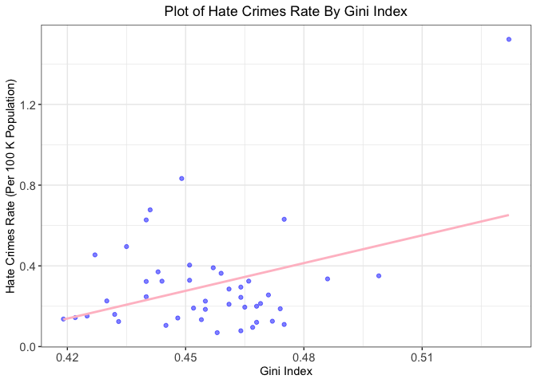

BM1 final project
================

    ## 'data.frame':    48 obs. of  9 variables:
    ##  $ state                                  : chr  "Alabama" "Alaska" "Arizona" "Arkansas" ...
    ##  $ unemployment                           : Factor w/ 2 levels "low","high": 2 2 2 2 2 1 2 1 2 2 ...
    ##  $ urbanization                           : Factor w/ 2 levels "low","high": 1 1 2 1 2 2 2 2 2 2 ...
    ##  $ median_household_income                : int  42278 67629 49254 44922 60487 60940 70161 57522 68277 46140 ...
    ##  $ perc_population_with_high_school_degree: num  0.821 0.914 0.842 0.824 0.806 0.893 0.886 0.874 0.871 0.853 ...
    ##  $ perc_non_citizen                       : num  0.02 0.04 0.1 0.04 0.13 0.06 0.06 0.05 0.11 0.09 ...
    ##  $ gini_index                             : num  0.472 0.422 0.455 0.458 0.471 0.457 0.486 0.44 0.532 0.474 ...
    ##  $ perc_non_white                         : num  0.35 0.42 0.49 0.26 0.61 0.31 0.3 0.37 0.63 0.46 ...
    ##  $ hate_crimes_per_100k_splc              : num  0.1258 0.1437 0.2253 0.0691 0.2558 ...

## Descriptive statistics+Graphs

    ## 
    ## Table: Descriptive Characteristics of Study Sample, Hate Crimes Occurring in the United States (By State)
    ## 
    ## |                                                         |   Overall (N=48)    |
    ## |:--------------------------------------------------------|:-------------------:|
    ## |Hate crime rate per 100k population                      |                     |
    ## |-  Mean/SD                                               |     0.30 (0.25)     |
    ## |-  Median                                                |        0.23         |
    ## |-  IQR                                                   |        0.21         |
    ## |-  Min - Max                                             |     0.07 - 1.52     |
    ## |-  Missing                                               |          3          |
    ## |Level of state unemployment                              |                     |
    ## |-  low                                                   |     25 (52.1%)      |
    ## |-  high                                                  |     23 (47.9%)      |
    ## |-  Missing                                               |          0          |
    ## |Level of state urbanization                              |                     |
    ## |-  low                                                   |     24 (50.0%)      |
    ## |-  high                                                  |     24 (50.0%)      |
    ## |-  Missing                                               |          0          |
    ## |Median household income per state                        |                     |
    ## |-  Mean/SD                                               | 55752.50 (9016.68)  |
    ## |-  Median                                                |      55431.50       |
    ## |-  IQR                                                   |      11827.00       |
    ## |-  Min - Max                                             | 39552.00 - 76165.00 |
    ## |-  Missing                                               |          0          |
    ## |Percentage of adults (>25 yrs) with a high school degree |                     |
    ## |-  Mean/SD                                               |     0.87 (0.03)     |
    ## |-  Median                                                |        0.87         |
    ## |-  IQR                                                   |        0.06         |
    ## |-  Min - Max                                             |     0.80 - 0.92     |
    ## |-  Missing                                               |          0          |
    ## |Percentage of population that are not US citizens        |                     |
    ## |-  Mean/SD                                               |     0.05 (0.03)     |
    ## |-  Median                                                |        0.04         |
    ## |-  IQR                                                   |        0.05         |
    ## |-  Min - Max                                             |     0.01 - 0.13     |
    ## |-  Missing                                               |          0          |
    ## |Gini index                                               |                     |
    ## |-  Mean/SD                                               |     0.45 (0.02)     |
    ## |-  Median                                                |        0.45         |
    ## |-  IQR                                                   |        0.03         |
    ## |-  Min - Max                                             |     0.42 - 0.53     |
    ## |-  Missing                                               |          0          |
    ## |Percentage of population that are non-white              |                     |
    ## |-  Mean/SD                                               |     0.32 (0.16)     |
    ## |-  Median                                                |        0.29         |
    ## |-  IQR                                                   |        0.22         |
    ## |-  Min - Max                                             |     0.06 - 0.81     |
    ## |-  Missing                                               |          0          |

<!-- --><!-- -->

## Varible Selection

<!-- -->

    ##                                         median_household_income
    ## median_household_income                                    1.00
    ## perc_population_with_high_school_degree                    0.65
    ## perc_non_citizen                                           0.30
    ## gini_index                                                -0.13
    ## perc_non_white                                             0.04
    ## hate_crimes_per_100k_splc                                  0.34
    ##                                         perc_population_with_high_school_degree
    ## median_household_income                                                    0.65
    ## perc_population_with_high_school_degree                                    1.00
    ## perc_non_citizen                                                          -0.26
    ## gini_index                                                                -0.54
    ## perc_non_white                                                            -0.50
    ## hate_crimes_per_100k_splc                                                  0.26
    ##                                         perc_non_citizen gini_index
    ## median_household_income                             0.30      -0.13
    ## perc_population_with_high_school_degree            -0.26      -0.54
    ## perc_non_citizen                                    1.00       0.48
    ## gini_index                                          0.48       1.00
    ## perc_non_white                                      0.75       0.55
    ## hate_crimes_per_100k_splc                           0.24       0.38
    ##                                         perc_non_white
    ## median_household_income                           0.04
    ## perc_population_with_high_school_degree          -0.50
    ## perc_non_citizen                                  0.75
    ## gini_index                                        0.55
    ## perc_non_white                                    1.00
    ## hate_crimes_per_100k_splc                         0.11
    ##                                         hate_crimes_per_100k_splc
    ## median_household_income                                      0.34
    ## perc_population_with_high_school_degree                      0.26
    ## perc_non_citizen                                             0.24
    ## gini_index                                                   0.38
    ## perc_non_white                                               0.11
    ## hate_crimes_per_100k_splc                                    1.00

median\_household\_income and
perc\_population\_with\_high\_school\_degree may highly correlated.
perc\_non\_white and perc\_non\_cizen may highly correlated.

``` r
# 2. Simple linear regression model: hate crime rates~ median household income
ggplot(data=crimes,aes(x=median_household_income,y=hate_crimes_per_100k_splc))+
geom_point(color="blue",alpha=0.5) +geom_smooth(method="lm",se=F,color="pink")+labs(title="Plot of Hate Crimes Rate By Median Household Income ",y="Hate Crimes Rate (Per 100 K Population)", x = "Median Household Income")+mytheme
```

    ## `geom_smooth()` using formula 'y ~ x'

    ## Warning: Removed 3 rows containing non-finite values (stat_smooth).

    ## Warning: Removed 3 rows containing missing values (geom_point).

<!-- -->

``` r
res_crimes_income<-lm(hate_crimes_per_100k_splc~median_household_income,data=crimes)
summary(res_crimes_income)
```

    ## 
    ## Call:
    ## lm(formula = hate_crimes_per_100k_splc ~ median_household_income, 
    ##     data = crimes)
    ## 
    ## Residuals:
    ##      Min       1Q   Median       3Q      Max 
    ## -0.32518 -0.12668 -0.04373  0.05772  1.09488 
    ## 
    ## Coefficients:
    ##                           Estimate Std. Error t value Pr(>|t|)  
    ## (Intercept)             -2.302e-01  2.247e-01  -1.024   0.3114  
    ## median_household_income  9.631e-06  4.012e-06   2.401   0.0208 *
    ## ---
    ## Signif. codes:  0 '***' 0.001 '**' 0.01 '*' 0.05 '.' 0.1 ' ' 1
    ## 
    ## Residual standard error: 0.239 on 43 degrees of freedom
    ##   (3 observations deleted due to missingness)
    ## Multiple R-squared:  0.1182, Adjusted R-squared:  0.09768 
    ## F-statistic: 5.763 on 1 and 43 DF,  p-value: 0.02076

``` r
# 3. Varibale Selection- backwards selection
res1 <- lm(hate_crimes_per_100k_splc ~ .-state, data=crimes)
summary(res1)
```

    ## 
    ## Call:
    ## lm(formula = hate_crimes_per_100k_splc ~ . - state, data = crimes)
    ## 
    ## Residuals:
    ##      Min       1Q   Median       3Q      Max 
    ## -0.36552 -0.10314 -0.01316  0.09731  0.51389 
    ## 
    ## Coefficients:
    ##                                           Estimate Std. Error t value Pr(>|t|)
    ## (Intercept)                             -8.250e+00  1.897e+00  -4.349 0.000103
    ## unemploymenthigh                        -1.307e-02  7.173e-02  -0.182 0.856425
    ## urbanizationhigh                        -3.309e-02  8.475e-02  -0.390 0.698475
    ## median_household_income                 -1.504e-06  5.961e-06  -0.252 0.802193
    ## perc_population_with_high_school_degree  5.382e+00  1.835e+00   2.933 0.005735
    ## perc_non_citizen                         1.233e+00  1.877e+00   0.657 0.515332
    ## gini_index                               8.624e+00  1.973e+00   4.370 9.67e-05
    ## perc_non_white                          -5.842e-03  3.673e-01  -0.016 0.987396
    ##                                            
    ## (Intercept)                             ***
    ## unemploymenthigh                           
    ## urbanizationhigh                           
    ## median_household_income                    
    ## perc_population_with_high_school_degree ** 
    ## perc_non_citizen                           
    ## gini_index                              ***
    ## perc_non_white                             
    ## ---
    ## Signif. codes:  0 '***' 0.001 '**' 0.01 '*' 0.05 '.' 0.1 ' ' 1
    ## 
    ## Residual standard error: 0.2014 on 37 degrees of freedom
    ##   (3 observations deleted due to missingness)
    ## Multiple R-squared:  0.461,  Adjusted R-squared:  0.3591 
    ## F-statistic: 4.521 on 7 and 37 DF,  p-value: 0.001007

``` r
step1<-update(res1, . ~ . -perc_non_white)
summary(step1)
```

    ## 
    ## Call:
    ## lm(formula = hate_crimes_per_100k_splc ~ unemployment + urbanization + 
    ##     median_household_income + perc_population_with_high_school_degree + 
    ##     perc_non_citizen + gini_index, data = crimes)
    ## 
    ## Residuals:
    ##      Min       1Q   Median       3Q      Max 
    ## -0.36516 -0.10256 -0.01341  0.09717  0.51338 
    ## 
    ## Coefficients:
    ##                                           Estimate Std. Error t value Pr(>|t|)
    ## (Intercept)                             -8.257e+00  1.823e+00  -4.529 5.71e-05
    ## unemploymenthigh                        -1.334e-02  6.879e-02  -0.194  0.84729
    ## urbanizationhigh                        -3.301e-02  8.349e-02  -0.395  0.69478
    ## median_household_income                 -1.518e-06  5.818e-06  -0.261  0.79558
    ## perc_population_with_high_school_degree  5.391e+00  1.721e+00   3.133  0.00333
    ## perc_non_citizen                         1.217e+00  1.554e+00   0.783  0.43846
    ## gini_index                               8.621e+00  1.941e+00   4.441 7.48e-05
    ##                                            
    ## (Intercept)                             ***
    ## unemploymenthigh                           
    ## urbanizationhigh                           
    ## median_household_income                    
    ## perc_population_with_high_school_degree ** 
    ## perc_non_citizen                           
    ## gini_index                              ***
    ## ---
    ## Signif. codes:  0 '***' 0.001 '**' 0.01 '*' 0.05 '.' 0.1 ' ' 1
    ## 
    ## Residual standard error: 0.1987 on 38 degrees of freedom
    ##   (3 observations deleted due to missingness)
    ## Multiple R-squared:  0.461,  Adjusted R-squared:  0.3759 
    ## F-statistic: 5.417 on 6 and 38 DF,  p-value: 0.0003982

``` r
step2<-update(step1, . ~ . -unemployment)
summary(step2)
```

    ## 
    ## Call:
    ## lm(formula = hate_crimes_per_100k_splc ~ urbanization + median_household_income + 
    ##     perc_population_with_high_school_degree + perc_non_citizen + 
    ##     gini_index, data = crimes)
    ## 
    ## Residuals:
    ##      Min       1Q   Median       3Q      Max 
    ## -0.37123 -0.10827 -0.01111  0.09475  0.51139 
    ## 
    ## Coefficients:
    ##                                           Estimate Std. Error t value Pr(>|t|)
    ## (Intercept)                             -8.284e+00  1.795e+00  -4.616 4.18e-05
    ## urbanizationhigh                        -3.477e-02  8.197e-02  -0.424  0.67371
    ## median_household_income                 -1.438e-06  5.732e-06  -0.251  0.80317
    ## perc_population_with_high_school_degree  5.443e+00  1.678e+00   3.243  0.00243
    ## perc_non_citizen                         1.211e+00  1.534e+00   0.789  0.43462
    ## gini_index                               8.560e+00  1.892e+00   4.525 5.53e-05
    ##                                            
    ## (Intercept)                             ***
    ## urbanizationhigh                           
    ## median_household_income                    
    ## perc_population_with_high_school_degree ** 
    ## perc_non_citizen                           
    ## gini_index                              ***
    ## ---
    ## Signif. codes:  0 '***' 0.001 '**' 0.01 '*' 0.05 '.' 0.1 ' ' 1
    ## 
    ## Residual standard error: 0.1963 on 39 degrees of freedom
    ##   (3 observations deleted due to missingness)
    ## Multiple R-squared:  0.4605, Adjusted R-squared:  0.3913 
    ## F-statistic: 6.657 on 5 and 39 DF,  p-value: 0.0001437

``` r
step3<-update(step2, . ~ . -urbanization) # since median_household income is the primary predictor, keep it
summary(step3)
```

    ## 
    ## Call:
    ## lm(formula = hate_crimes_per_100k_splc ~ median_household_income + 
    ##     perc_population_with_high_school_degree + perc_non_citizen + 
    ##     gini_index, data = crimes)
    ## 
    ## Residuals:
    ##      Min       1Q   Median       3Q      Max 
    ## -0.36668 -0.10241 -0.01789  0.09560  0.52686 
    ## 
    ## Coefficients:
    ##                                           Estimate Std. Error t value Pr(>|t|)
    ## (Intercept)                             -8.193e+00  1.763e+00  -4.646 3.63e-05
    ## median_household_income                 -1.625e-06  5.656e-06  -0.287  0.77543
    ## perc_population_with_high_school_degree  5.429e+00  1.661e+00   3.269  0.00222
    ## perc_non_citizen                         8.902e-01  1.321e+00   0.674  0.50423
    ## gini_index                               8.407e+00  1.838e+00   4.574 4.55e-05
    ##                                            
    ## (Intercept)                             ***
    ## median_household_income                    
    ## perc_population_with_high_school_degree ** 
    ## perc_non_citizen                           
    ## gini_index                              ***
    ## ---
    ## Signif. codes:  0 '***' 0.001 '**' 0.01 '*' 0.05 '.' 0.1 ' ' 1
    ## 
    ## Residual standard error: 0.1942 on 40 degrees of freedom
    ##   (3 observations deleted due to missingness)
    ## Multiple R-squared:  0.458,  Adjusted R-squared:  0.4038 
    ## F-statistic:  8.45 on 4 and 40 DF,  p-value: 4.864e-05

``` r
step4<-update(step3, . ~ . -perc_non_citizen)
summary(step4)
```

    ## 
    ## Call:
    ## lm(formula = hate_crimes_per_100k_splc ~ median_household_income + 
    ##     perc_population_with_high_school_degree + gini_index, data = crimes)
    ## 
    ## Residuals:
    ##      Min       1Q   Median       3Q      Max 
    ## -0.33932 -0.12201 -0.02784  0.11448  0.52305 
    ## 
    ## Coefficients:
    ##                                           Estimate Std. Error t value Pr(>|t|)
    ## (Intercept)                             -7.979e+00  1.723e+00  -4.630 3.65e-05
    ## median_household_income                  6.158e-07  4.546e-06   0.135  0.89290
    ## perc_population_with_high_school_degree  4.920e+00  1.469e+00   3.349  0.00175
    ## gini_index                               8.743e+00  1.757e+00   4.976 1.21e-05
    ##                                            
    ## (Intercept)                             ***
    ## median_household_income                    
    ## perc_population_with_high_school_degree ** 
    ## gini_index                              ***
    ## ---
    ## Signif. codes:  0 '***' 0.001 '**' 0.01 '*' 0.05 '.' 0.1 ' ' 1
    ## 
    ## Residual standard error: 0.1929 on 41 degrees of freedom
    ##   (3 observations deleted due to missingness)
    ## Multiple R-squared:  0.4518, Adjusted R-squared:  0.4117 
    ## F-statistic: 11.27 on 3 and 41 DF,  p-value: 1.596e-05

``` r
multi_fit1<-lm(hate_crimes_per_100k_splc~median_household_income+perc_population_with_high_school_degree+gini_index,data=crimes)
summary(multi_fit1)
```

    ## 
    ## Call:
    ## lm(formula = hate_crimes_per_100k_splc ~ median_household_income + 
    ##     perc_population_with_high_school_degree + gini_index, data = crimes)
    ## 
    ## Residuals:
    ##      Min       1Q   Median       3Q      Max 
    ## -0.33932 -0.12201 -0.02784  0.11448  0.52305 
    ## 
    ## Coefficients:
    ##                                           Estimate Std. Error t value Pr(>|t|)
    ## (Intercept)                             -7.979e+00  1.723e+00  -4.630 3.65e-05
    ## median_household_income                  6.158e-07  4.546e-06   0.135  0.89290
    ## perc_population_with_high_school_degree  4.920e+00  1.469e+00   3.349  0.00175
    ## gini_index                               8.743e+00  1.757e+00   4.976 1.21e-05
    ##                                            
    ## (Intercept)                             ***
    ## median_household_income                    
    ## perc_population_with_high_school_degree ** 
    ## gini_index                              ***
    ## ---
    ## Signif. codes:  0 '***' 0.001 '**' 0.01 '*' 0.05 '.' 0.1 ' ' 1
    ## 
    ## Residual standard error: 0.1929 on 41 degrees of freedom
    ##   (3 observations deleted due to missingness)
    ## Multiple R-squared:  0.4518, Adjusted R-squared:  0.4117 
    ## F-statistic: 11.27 on 3 and 41 DF,  p-value: 1.596e-05

``` r
# 4. Criterion Selection
best <- function(model, ...) 
{
  subsets <- regsubsets(formula(model), model.frame(model), ...)
  subsets <- with(summary(subsets),
                  cbind(p = as.numeric(rownames(which)), which, rss, rsq, adjr2, cp, bic))
  
  return(subsets)
}  


round(best(multi_fit1, nbest = 1), 3) # chose model2 with the minimum cp, BIC and highest adjusted R2
```

    ##   p (Intercept) median_household_income perc_population_with_high_school_degree
    ## 1 1           1                       0                                       0
    ## 2 2           1                       0                                       1
    ## 3 3           1                       1                                       1
    ##   gini_index   rss   rsq adjr2     cp     bic
    ## 1          1 2.381 0.145 0.125 22.967   0.575
    ## 2          1 1.527 0.452 0.425  2.018 -15.613
    ## 3          1 1.526 0.452 0.412  4.000 -11.827

``` r
multi_fit2<-lm(hate_crimes_per_100k_splc~perc_population_with_high_school_degree+gini_index,data=crimes)
summary(multi_fit2)
```

    ## 
    ## Call:
    ## lm(formula = hate_crimes_per_100k_splc ~ perc_population_with_high_school_degree + 
    ##     gini_index, data = crimes)
    ## 
    ## Residuals:
    ##      Min       1Q   Median       3Q      Max 
    ## -0.33490 -0.11891 -0.03105  0.11430  0.52418 
    ## 
    ## Coefficients:
    ##                                         Estimate Std. Error t value Pr(>|t|)
    ## (Intercept)                               -8.103      1.447  -5.601 1.48e-06
    ## perc_population_with_high_school_degree    5.059      1.044   4.847 1.74e-05
    ## gini_index                                 8.825      1.630   5.413 2.76e-06
    ##                                            
    ## (Intercept)                             ***
    ## perc_population_with_high_school_degree ***
    ## gini_index                              ***
    ## ---
    ## Signif. codes:  0 '***' 0.001 '**' 0.01 '*' 0.05 '.' 0.1 ' ' 1
    ## 
    ## Residual standard error: 0.1907 on 42 degrees of freedom
    ##   (3 observations deleted due to missingness)
    ## Multiple R-squared:  0.4516, Adjusted R-squared:  0.4255 
    ## F-statistic: 17.29 on 2 and 42 DF,  p-value: 3.32e-06

``` r
# 5. Check interactions between median income and perc of highschool degree
res_interaction<-lm(hate_crimes_per_100k_splc~median_household_income*perc_population_with_high_school_degree+gini_index,data=crimes)
summary(res_interaction) # No-interaction between income and high school degree
```

    ## 
    ## Call:
    ## lm(formula = hate_crimes_per_100k_splc ~ median_household_income * 
    ##     perc_population_with_high_school_degree + gini_index, data = crimes)
    ## 
    ## Residuals:
    ##      Min       1Q   Median       3Q      Max 
    ## -0.34026 -0.11791 -0.03244  0.11251  0.52198 
    ## 
    ## Coefficients:
    ##                                                                   Estimate
    ## (Intercept)                                                     -7.067e+00
    ## median_household_income                                         -1.707e-05
    ## perc_population_with_high_school_degree                          3.837e+00
    ## gini_index                                                       8.801e+00
    ## median_household_income:perc_population_with_high_school_degree  2.033e-05
    ##                                                                 Std. Error
    ## (Intercept)                                                      5.725e+00
    ## median_household_income                                          1.058e-04
    ## perc_population_with_high_school_degree                          6.643e+00
    ## gini_index                                                       1.811e+00
    ## median_household_income:perc_population_with_high_school_degree  1.215e-04
    ##                                                                 t value
    ## (Intercept)                                                      -1.234
    ## median_household_income                                          -0.161
    ## perc_population_with_high_school_degree                           0.578
    ## gini_index                                                        4.859
    ## median_household_income:perc_population_with_high_school_degree   0.167
    ##                                                                 Pr(>|t|)    
    ## (Intercept)                                                        0.224    
    ## median_household_income                                            0.873    
    ## perc_population_with_high_school_degree                            0.567    
    ## gini_index                                                      1.86e-05 ***
    ## median_household_income:perc_population_with_high_school_degree    0.868    
    ## ---
    ## Signif. codes:  0 '***' 0.001 '**' 0.01 '*' 0.05 '.' 0.1 ' ' 1
    ## 
    ## Residual standard error: 0.1953 on 40 degrees of freedom
    ##   (3 observations deleted due to missingness)
    ## Multiple R-squared:  0.4522, Adjusted R-squared:  0.3974 
    ## F-statistic: 8.256 on 4 and 40 DF,  p-value: 5.943e-05

``` r
# Check interactions between urbanization and gini_index
ggplot(data=crimes,aes(x=gini_index,y=hate_crimes_per_100k_splc,color=urbanization))+
geom_point() +geom_smooth(method="lm",se=F)+labs(title="Plot of Hate Crimes Rate vs Gini index By Urbanization level ",y="Hate Crimes Rate (Per 100 K Population)", x = "Gini index")+ mytheme
```

    ## `geom_smooth()` using formula 'y ~ x'

    ## Warning: Removed 3 rows containing non-finite values (stat_smooth).
    
    ## Warning: Removed 3 rows containing missing values (geom_point).

<!-- -->

``` r
res_interaction2<-lm(hate_crimes_per_100k_splc~perc_population_with_high_school_degree+gini_index*urbanization,data=crimes)
summary(res_interaction2) # No interaction b/w urbanization and gini index
```

    ## 
    ## Call:
    ## lm(formula = hate_crimes_per_100k_splc ~ perc_population_with_high_school_degree + 
    ##     gini_index * urbanization, data = crimes)
    ## 
    ## Residuals:
    ##      Min       1Q   Median       3Q      Max 
    ## -0.33743 -0.12559 -0.02552  0.10649  0.53288 
    ## 
    ## Coefficients:
    ##                                         Estimate Std. Error t value Pr(>|t|)
    ## (Intercept)                              -8.6525     2.6495  -3.266 0.002244
    ## perc_population_with_high_school_degree   5.2314     1.2693   4.121 0.000184
    ## gini_index                                9.7180     3.9664   2.450 0.018755
    ## urbanizationhigh                          0.4743     1.8377   0.258 0.797673
    ## gini_index:urbanizationhigh              -1.0506     4.0781  -0.258 0.798014
    ##                                            
    ## (Intercept)                             ** 
    ## perc_population_with_high_school_degree ***
    ## gini_index                              *  
    ## urbanizationhigh                           
    ## gini_index:urbanizationhigh                
    ## ---
    ## Signif. codes:  0 '***' 0.001 '**' 0.01 '*' 0.05 '.' 0.1 ' ' 1
    ## 
    ## Residual standard error: 0.1952 on 40 degrees of freedom
    ##   (3 observations deleted due to missingness)
    ## Multiple R-squared:  0.4525, Adjusted R-squared:  0.3978 
    ## F-statistic: 8.265 on 4 and 40 DF,  p-value: 5.885e-05

\#\#final model(complete variables selection)

``` r
final_fit = lm(hate_crimes_per_100k_splc ~ perc_population_with_high_school_degree + gini_index,data=crimes)
summary(final_fit)
```

    ## 
    ## Call:
    ## lm(formula = hate_crimes_per_100k_splc ~ perc_population_with_high_school_degree + 
    ##     gini_index, data = crimes)
    ## 
    ## Residuals:
    ##      Min       1Q   Median       3Q      Max 
    ## -0.33490 -0.11891 -0.03105  0.11430  0.52418 
    ## 
    ## Coefficients:
    ##                                         Estimate Std. Error t value Pr(>|t|)
    ## (Intercept)                               -8.103      1.447  -5.601 1.48e-06
    ## perc_population_with_high_school_degree    5.059      1.044   4.847 1.74e-05
    ## gini_index                                 8.825      1.630   5.413 2.76e-06
    ##                                            
    ## (Intercept)                             ***
    ## perc_population_with_high_school_degree ***
    ## gini_index                              ***
    ## ---
    ## Signif. codes:  0 '***' 0.001 '**' 0.01 '*' 0.05 '.' 0.1 ' ' 1
    ## 
    ## Residual standard error: 0.1907 on 42 degrees of freedom
    ##   (3 observations deleted due to missingness)
    ## Multiple R-squared:  0.4516, Adjusted R-squared:  0.4255 
    ## F-statistic: 17.29 on 2 and 42 DF,  p-value: 3.32e-06

``` r
par(mfrow=c(2,2))
plot(final_fit) # need transformation
```

<!-- -->

## model diagonsis

### box cox

``` r
boxcox(final_fit)
```

<!-- -->

lamda =0, get maximum likelihood, so the outcome should be applied to
log transformation.

``` r
crime_log = 
  crimes %>%
  mutate(ln_hate_crime_outcome = log(hate_crimes_per_100k_splc, base = exp(1))) 
  
final_fit2 = 
  lm(ln_hate_crime_outcome ~ perc_population_with_high_school_degree + gini_index , data = crime_log)
summary(final_fit2)
```

    ## 
    ## Call:
    ## lm(formula = ln_hate_crime_outcome ~ perc_population_with_high_school_degree + 
    ##     gini_index, data = crime_log)
    ## 
    ## Residuals:
    ##      Min       1Q   Median       3Q      Max 
    ## -1.34787 -0.39659 -0.00387  0.44892  1.06723 
    ## 
    ## Coefficients:
    ##                                         Estimate Std. Error t value Pr(>|t|)
    ## (Intercept)                              -18.947      4.254  -4.454 6.14e-05
    ## perc_population_with_high_school_degree   11.554      3.069   3.765 0.000512
    ## gini_index                                16.486      4.795   3.438 0.001334
    ##                                            
    ## (Intercept)                             ***
    ## perc_population_with_high_school_degree ***
    ## gini_index                              ** 
    ## ---
    ## Signif. codes:  0 '***' 0.001 '**' 0.01 '*' 0.05 '.' 0.1 ' ' 1
    ## 
    ## Residual standard error: 0.5608 on 42 degrees of freedom
    ##   (3 observations deleted due to missingness)
    ## Multiple R-squared:  0.288,  Adjusted R-squared:  0.2541 
    ## F-statistic: 8.496 on 2 and 42 DF,  p-value: 0.0007974

### Identify Collinearity

``` r
# Calculate the variance inflation factor (VIF)
vif(final_fit2)
```

    ## perc_population_with_high_school_degree                              gini_index 
    ##                                 1.40556                                 1.40556

no VIF higher than 5, nothing should be removed because of collinearity

### check for outliers

``` r
# Measures of influence:
# Gives DFFITS, Cook's Distance, Hat diagonal elements, and others.

influence.measures(final_fit2)
```

    ## Influence measures of
    ##   lm(formula = ln_hate_crime_outcome ~ perc_population_with_high_school_degree +      gini_index, data = crime_log) :
    ## 
    ##       dfb.1_ dfb.p___  dfb.gn_n    dffit cov.r   cook.d    hat inf
    ## 1  -0.081618  0.13038 -4.05e-03 -0.19261 1.109 1.25e-02 0.0666    
    ## 2  -0.013893 -0.10481  1.49e-01 -0.30406 1.109 3.09e-02 0.0922    
    ## 3   0.054057 -0.05763 -3.27e-02  0.08493 1.108 2.45e-03 0.0412    
    ## 4  -0.304896  0.34577  1.64e-01 -0.41699 0.987 5.63e-02 0.0720    
    ## 5   0.191496 -0.26261 -4.75e-02  0.32205 1.122 3.47e-02 0.1027    
    ## 6  -0.039118  0.04304  2.54e-02  0.06064 1.119 1.25e-03 0.0450    
    ## 7   0.251790 -0.19747 -2.54e-01 -0.29040 1.186 2.84e-02 0.1302    
    ## 8   0.068771 -0.02700 -9.62e-02  0.16236 1.060 8.85e-03 0.0360    
    ## 9  -1.027893  0.67191  1.19e+00  1.22378 1.778 4.91e-01 0.4655   *
    ## 10  0.046163 -0.00709 -8.54e-02 -0.14609 1.078 7.20e-03 0.0398    
    ## 11 -0.053388  0.10169 -2.60e-02 -0.21260 1.032 1.50e-02 0.0390    
    ## 13 -0.075257  0.00825  1.31e-01 -0.20352 1.067 1.39e-02 0.0491    
    ## 14  0.031597 -0.01738 -4.38e-02 -0.10108 1.077 3.46e-03 0.0275    
    ## 15  0.063828 -0.04013 -7.24e-02  0.10745 1.099 3.92e-03 0.0407    
    ## 16 -0.024348  0.13848 -1.15e-01  0.30940 1.082 3.18e-02 0.0813    
    ## 17  0.133702 -0.22611  3.91e-03 -0.39474 0.874 4.90e-02 0.0419    
    ## 18  0.235394 -0.30556 -7.86e-02  0.38074 1.031 4.75e-02 0.0780    
    ## 19 -0.093402  0.17570 -3.85e-02 -0.28997 1.056 2.79e-02 0.0658    
    ## 20 -0.013703  0.04710 -2.68e-02  0.12712 1.079 5.46e-03 0.0355    
    ## 21 -0.182960  0.15692  1.69e-01  0.21549 1.139 1.57e-02 0.0886    
    ## 22 -0.019768  0.03790 -2.98e-03  0.13067 1.052 5.74e-03 0.0255    
    ## 23 -0.154266  0.24423  1.03e-02  0.34035 1.041 3.82e-02 0.0722    
    ## 24 -0.000508 -0.00222  8.76e-04 -0.07363 1.081 1.84e-03 0.0223    
    ## 25 -0.056507  0.14587 -6.12e-02  0.27564 1.054 2.52e-02 0.0618    
    ## 26 -0.014601 -0.04569  7.99e-02 -0.17059 1.098 9.82e-03 0.0554    
    ## 27 -0.031721  0.03033  2.39e-02 -0.03988 1.142 5.43e-04 0.0600    
    ## 28  0.002872 -0.10873  1.21e-01 -0.27889 1.104 2.60e-02 0.0840    
    ## 29  0.248803 -0.20839 -2.46e-01 -0.47387 0.701 6.58e-02 0.0320   *
    ## 30  0.127658 -0.16623 -4.07e-02  0.22682 1.069 1.72e-02 0.0558    
    ## 31  0.049492 -0.02110 -7.20e-02 -0.08242 1.229 2.32e-03 0.1282   *
    ## 32  0.015806 -0.02440  4.52e-04  0.04951 1.107 8.36e-04 0.0341    
    ## 34  0.008525 -0.01768  2.00e-03 -0.07960 1.081 2.15e-03 0.0241    
    ## 35 -0.054224  0.05286  3.67e-02 -0.13131 1.055 5.80e-03 0.0267    
    ## 36 -0.140534  0.20997  2.97e-02  0.38273 0.841 4.55e-02 0.0351    
    ## 37  0.011274 -0.01075 -9.53e-03 -0.02090 1.110 1.49e-04 0.0322    
    ## 38 -0.029075  0.09228 -6.52e-02 -0.29814 0.917 2.85e-02 0.0319    
    ## 39  0.026918 -0.03342 -1.04e-02  0.04908 1.120 8.21e-04 0.0442    
    ## 40  0.003366 -0.00523  2.32e-05  0.00839 1.131 2.40e-05 0.0492    
    ## 41  0.214374 -0.27630 -7.60e-02  0.31860 1.170 3.41e-02 0.1268    
    ## 42 -0.065943 -0.02807  1.58e-01 -0.23735 1.140 1.90e-02 0.0936    
    ## 43  0.003208 -0.00467 -7.03e-04 -0.00639 1.147 1.39e-05 0.0631    
    ## 44 -0.011898  0.00781  1.74e-02  0.09922 1.067 3.33e-03 0.0229    
    ## 45 -0.070951  0.17415 -6.38e-02  0.36609 0.911 4.27e-02 0.0432    
    ## 46  0.372189 -0.38111 -2.51e-01  0.45593 0.978 6.69e-02 0.0776    
    ## 47 -0.000251 -0.00039  9.22e-04 -0.00177 1.143 1.07e-06 0.0595

``` r
# Look at the Cook's distance lines and notice obs 36 and 29 as potential Y outliers/influential points

par(mfrow=c(2,2))
plot(final_fit2)
```

<!-- -->

``` r
# Remove observations 9
crime_log_rm_9<-crime_log[c(-9),]
mult.fit_no9<- lm(ln_hate_crime_outcome ~ . -state -hate_crimes_per_100k_splc, data = crime_log_rm_9)

summary(mult.fit_no9)
```

    ## 
    ## Call:
    ## lm(formula = ln_hate_crime_outcome ~ . - state - hate_crimes_per_100k_splc, 
    ##     data = crime_log_rm_9)
    ## 
    ## Residuals:
    ##      Min       1Q   Median       3Q      Max 
    ## -1.17560 -0.35011  0.02951  0.35998  1.11574 
    ## 
    ## Coefficients:
    ##                                           Estimate Std. Error t value Pr(>|t|)
    ## (Intercept)                             -1.232e+01  6.694e+00  -1.840    0.074
    ## unemploymenthigh                        -2.235e-01  2.049e-01  -1.091    0.283
    ## urbanizationhigh                         1.986e-01  2.503e-01   0.793    0.433
    ## median_household_income                 -6.492e-06  1.706e-05  -0.380    0.706
    ## perc_population_with_high_school_degree  8.238e+00  5.575e+00   1.478    0.148
    ## perc_non_citizen                         1.568e+00  5.367e+00   0.292    0.772
    ## gini_index                               9.146e+00  7.431e+00   1.231    0.226
    ## perc_non_white                          -5.079e-01  1.078e+00  -0.471    0.640
    ##                                          
    ## (Intercept)                             .
    ## unemploymenthigh                         
    ## urbanizationhigh                         
    ## median_household_income                  
    ## perc_population_with_high_school_degree  
    ## perc_non_citizen                         
    ## gini_index                               
    ## perc_non_white                           
    ## ---
    ## Signif. codes:  0 '***' 0.001 '**' 0.01 '*' 0.05 '.' 0.1 ' ' 1
    ## 
    ## Residual standard error: 0.5752 on 36 degrees of freedom
    ##   (3 observations deleted due to missingness)
    ## Multiple R-squared:  0.2102, Adjusted R-squared:  0.05667 
    ## F-statistic: 1.369 on 7 and 36 DF,  p-value: 0.2481

``` r
mult.fit_no9 %>% 
  broom::tidy() %>% 
  knitr::kable()
```

| term                                         |     estimate | std.error |   statistic |   p.value |
| :------------------------------------------- | -----------: | --------: | ----------: | --------: |
| (Intercept)                                  | \-12.3163054 | 6.6939557 | \-1.8399144 | 0.0740376 |
| unemploymenthigh                             |  \-0.2235412 | 0.2048939 | \-1.0910097 | 0.2825171 |
| urbanizationhigh                             |    0.1986136 | 0.2503358 |   0.7933888 | 0.4327497 |
| median\_household\_income                    |  \-0.0000065 | 0.0000171 | \-0.3804798 | 0.7058251 |
| perc\_population\_with\_high\_school\_degree |    8.2384517 | 5.5751399 |   1.4777121 | 0.1481810 |
| perc\_non\_citizen                           |    1.5681815 | 5.3668087 |   0.2922000 | 0.7718111 |
| gini\_index                                  |    9.1461035 | 7.4312797 |   1.2307575 | 0.2263946 |
| perc\_non\_white                             |  \-0.5078851 | 1.0776599 | \-0.4712852 | 0.6402807 |

``` r
influence.measures(mult.fit_no9)
```

    ## Influence measures of
    ##   lm(formula = ln_hate_crime_outcome ~ . - state - hate_crimes_per_100k_splc,      data = crime_log_rm_9) :
    ## 
    ##       dfb.1_ dfb.unmp dfb.urbn  dfb.md__ dfb.p___ dfb.prc_nn_c dfb.gn_n
    ## 1   0.009525 -0.02361  0.04034 -0.018624  0.02319      0.07908 -0.05152
    ## 2   0.022909 -0.13558  0.08541 -0.069571 -0.06331      0.08235  0.07297
    ## 3   0.022597  0.02983  0.01546 -0.063955  0.01658      0.06830 -0.05690
    ## 4  -0.275072 -0.22471  0.20944 -0.112558  0.30986     -0.11212  0.10994
    ## 5   0.339196  0.07858 -0.17175  0.337978 -0.41855      0.26248 -0.17096
    ## 6  -0.025637 -0.03119  0.02866 -0.010593  0.02438     -0.01478  0.01919
    ## 7  -0.013551  0.00896 -0.00116  0.014222  0.00295     -0.00738  0.01950
    ## 8   0.067749 -0.10293  0.14334 -0.006286 -0.02868     -0.10361 -0.09181
    ## 10  0.156047 -0.04300 -0.00761  0.209841 -0.19087     -0.10520 -0.08219
    ## 11  0.032168 -0.05522 -0.07581  0.105456 -0.05924     -0.00754  0.00162
    ## 13 -0.122981  0.08703  0.10561  0.090471  0.03441     -0.19230  0.15862
    ## 14  0.036406 -0.05448 -0.03604  0.022687 -0.03844     -0.00358 -0.02200
    ## 15  0.022148 -0.03183 -0.00890 -0.022781 -0.00906      0.00947 -0.02236
    ## 16 -0.035754 -0.03193 -0.06342 -0.100652  0.11878      0.06789 -0.06854
    ## 17  0.385834  0.22610  0.28798  0.365956 -0.46028     -0.12841 -0.20280
    ## 18  0.241141 -0.23093 -0.08289  0.084433 -0.34478      0.06322  0.03050
    ## 19  0.000698  0.03329 -0.43141  0.025612  0.04202      0.60969 -0.07698
    ## 20  0.084598 -0.14158  0.07037  0.278427 -0.11842     -0.18774 -0.07672
    ## 21 -0.216437 -0.11288 -0.03175 -0.046286  0.14058      0.17052  0.24627
    ## 22 -0.004672 -0.09013  0.14248 -0.074064  0.03211     -0.05854 -0.01341
    ## 23 -0.145189 -0.01666 -0.33581  0.149186  0.09378      0.19023  0.12651
    ## 24 -0.000325 -0.01103  0.00634 -0.010309  0.00446      0.00534 -0.00380
    ## 25 -0.119499 -0.07066  0.00840 -0.205053  0.19698     -0.01956  0.01887
    ## 26  0.002171  0.05307  0.13157  0.093839 -0.07278     -0.16580  0.07339
    ## 27 -0.071561 -0.03981 -0.03145  0.065488  0.01076     -0.08209  0.11613
    ## 28 -0.240785 -0.04944  0.12471 -0.450151  0.29710      0.01531  0.14585
    ## 29  0.232803 -0.47008  0.27740 -0.138441 -0.17844     -0.58865 -0.14445
    ## 30 -0.222177  0.03104 -0.49094 -0.093456  0.20648     -0.24343  0.13572
    ## 31  0.054043  0.04446  0.01598  0.017654 -0.02872     -0.02397 -0.07156
    ## 32 -0.067123  0.08187 -0.15531 -0.038894  0.05115      0.03012  0.06940
    ## 34  0.061806  0.08251  0.05729  0.070515 -0.06005     -0.00816 -0.06106
    ## 35  0.064947  0.20365  0.11224  0.119720 -0.07213      0.03569 -0.05927
    ## 36 -0.088862  0.53731  0.25613 -0.193562  0.25415      0.31331 -0.14245
    ## 37 -0.011037  0.01998  0.03026  0.000653  0.00940     -0.02690  0.00928
    ## 38 -0.237643 -0.31936 -0.08375 -0.290945  0.34048     -0.24869  0.03857
    ## 39 -0.007231  0.05735 -0.07123 -0.000461 -0.00640     -0.06497  0.02586
    ## 40 -0.007310 -0.00589 -0.01936  0.004464  0.00671      0.00811  0.00277
    ## 41  0.126285 -0.13293  0.01050  0.058043 -0.14416      0.03239 -0.05824
    ## 42 -0.458249  0.12075 -0.59337 -0.074278  0.23010      0.18674  0.58774
    ## 43 -0.007574 -0.00247 -0.00460  0.006589  0.00323     -0.00601  0.01034
    ## 44  0.057312 -0.12503  0.09605  0.162835 -0.11306     -0.14545  0.01155
    ## 45 -0.067056  0.47792  0.19225 -0.318867  0.33356      0.39121 -0.28374
    ## 46  0.509451  0.35366  0.03866  0.042935 -0.48233      0.08845 -0.28033
    ## 47 -0.003170  0.00851  0.00695  0.001068 -0.00307      0.00276  0.00989
    ##    dfb.prc_nn_w   dffit cov.r   cook.d    hat inf
    ## 1     -4.63e-02 -0.1622 1.459 0.003370 0.1666    
    ## 2     -1.69e-01 -0.3144 1.854 0.012639 0.3518   *
    ## 3      2.21e-04  0.1314 1.450 0.002213 0.1546    
    ## 4      2.61e-01 -0.5837 0.930 0.041388 0.1432    
    ## 5     -1.00e-01  0.7281 1.367 0.065860 0.3031    
    ## 6      1.58e-02  0.0621 1.390 0.000495 0.1056    
    ## 7     -1.99e-03  0.0288 1.938 0.000106 0.3537   *
    ## 8      8.72e-02  0.2108 1.440 0.005679 0.1717    
    ## 10    -4.38e-02 -0.2816 1.433 0.010102 0.1905    
    ## 11    -8.61e-02 -0.2792 1.107 0.009767 0.0787    
    ## 13     1.60e-01 -0.4039 1.014 0.020156 0.1026    
    ## 14     2.17e-03 -0.1111 1.297 0.001581 0.0696    
    ## 15    -8.61e-03  0.0714 1.362 0.000655 0.0907    
    ## 16    -1.30e-02  0.3115 1.160 0.012186 0.1048    
    ## 17    -2.04e-01 -0.6966 0.655 0.056623 0.1197    
    ## 18    -2.96e-01  0.5959 1.333 0.044348 0.2556    
    ## 19    -3.40e-01 -0.7580 1.388 0.071345 0.3167    
    ## 20     2.23e-01  0.4713 1.549 0.028116 0.2865    
    ## 21    -1.20e-01  0.3997 1.409 0.020216 0.2188    
    ## 22     1.46e-02  0.1894 1.409 0.004585 0.1506    
    ## 23    -1.13e-01  0.5620 0.941 0.038459 0.1388    
    ## 24     3.68e-03 -0.0193 1.473 0.000048 0.1499    
    ## 25     7.69e-03  0.3793 1.166 0.018015 0.1319    
    ## 26     4.46e-02 -0.3030 1.187 0.011555 0.1092    
    ## 27     7.77e-04 -0.1846 1.491 0.004365 0.1876    
    ## 28     2.26e-01 -0.6064 1.341 0.045906 0.2610    
    ## 29     2.09e-01 -1.0361 0.454 0.118939 0.1605    
    ## 30     8.29e-01  1.0823 0.981 0.139709 0.3000    
    ## 31    -8.38e-05 -0.0950 1.883 0.001160 0.3375   *
    ## 32     5.04e-02  0.2332 1.279 0.006905 0.1120    
    ## 34    -1.51e-02 -0.1736 1.280 0.003842 0.0881    
    ## 35    -1.71e-01 -0.3397 1.200 0.014510 0.1273    
    ## 36    -3.56e-01  0.8848 0.517 0.088440 0.1393    
    ## 37    -1.19e-05  0.0511 1.495 0.000336 0.1646    
    ## 38     5.41e-01 -0.7357 0.807 0.064428 0.1619    
    ## 39     6.71e-02  0.1950 1.315 0.004849 0.1109    
    ## 40     8.35e-03 -0.0297 1.485 0.000113 0.1571    
    ## 41     4.00e-03  0.2371 1.807 0.007204 0.3248   *
    ## 42     9.57e-02 -0.8490 1.057 0.087429 0.2557    
    ## 43    -6.90e-03  0.0285 1.433 0.000105 0.1269    
    ## 44     6.40e-02  0.2657 1.415 0.008992 0.1778    
    ## 45    -1.99e-01  0.8810 0.711 0.090682 0.1808    
    ## 46    -6.50e-01  0.9894 1.000 0.117424 0.2804    
    ## 47    -7.07e-03 -0.0314 1.359 0.000127 0.0808

``` r
par(mfrow=c(2,2))
plot(mult.fit_no9)
```

<!-- -->
